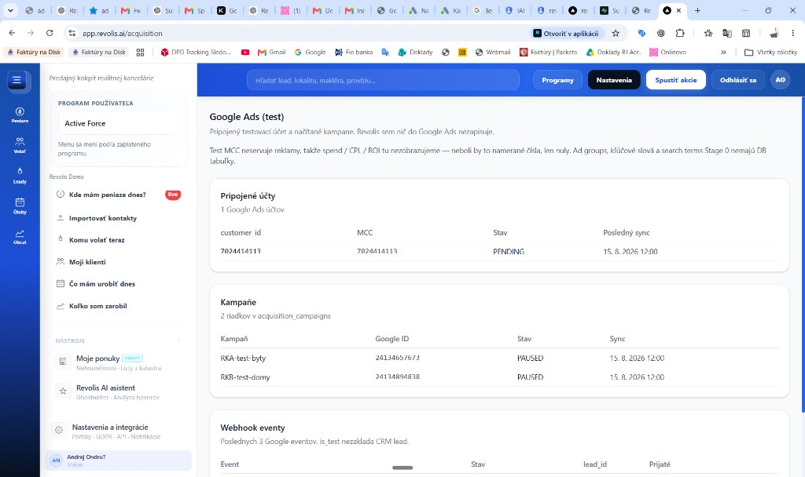
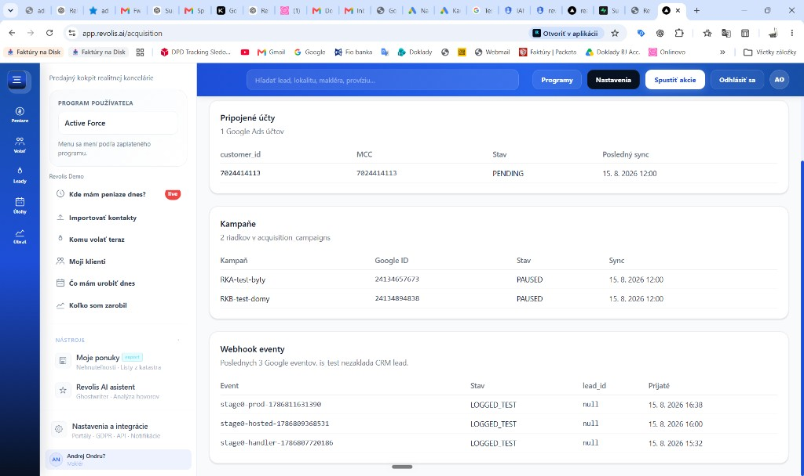

# Acquisition OS Stage 0 PASS report

**Datum:** 2026-08-15
**Kill deadline Stage 0:** 2026-08-31
**Test MCC:** `7024414113` (guard). Child ucty: RK A `3726370609`, RK B `2272781649`.
**Demo agency:** `b101361c-e250-4c43-b099-52c4febeb450`
**Connect account:** `40a02a8e-7e31-439e-aecd-11aec040b2a2`
**Pravidlo:** polozka bez dokazu = nesplnena. Ziadne secrets v tomto subore.

Addendum 15.8. vecer: produktovy `GoogleAdsClient.search()` po merge #413 + production screenshoty. **T2 ~2 min (founder) — STOP, nie PASS.**

## Verdikt

**Funkcny DoD drzi. Perfgate FAIL — Stage 0 PASS sa nerealizuje.** T1 aj T2 `/acquisition` ~2 min. Stage 1 sa nespusta.

Otvorene (nie Stage 1, ale stale pravda):

1. V CRM nie su tabulky pre ad groups / keywords / search terms / metrics. Workery su overene live + testami, nie persistenciou.
2. `GOOGLE_ADS_*` credentials su Preview-only. Production webhook kluc bol po hosted 200 zmazany.
3. HTTP/cron sync job neexistuje. Kampane v DB = display persist ziveho syncu, nie produktovy worker.
4. **T1 ~2 min, T2 ~2 min** (founder). Nie je to jednorazovy cold start. Supabase: acquisition SELECT-y su 200 za <2 s; ~1-2 min medzera je pred nimi (dashboard layout / workdesk shell).

## DoD checklist (blueprint §11)

| Polozka | Stav | Dokaz |
|---|---|---|
| OAuth connect funguje | PASS | `docs/reports/2026-08-17-stage0-smoke.md`: `POST /api/acquisition/google/connect` → 200, `PENDING`, Demo + `customer_id=7024414113`. Druhy connect → 409 unique. |
| credential sa ulozi encrypted | PASS s vyhradou | Stage 0 vault = Vercel env / `.env.local`, DB drzi len `credential_ref=env:GOOGLE_ADS_SA_KEY_JSON`. Nie KMS. Response connect/accounts/dashboard **neobsahuje** `credential_ref` ani SA JSON. |
| test MCC sa identifikuje | PASS | Connect aj webhook lookup via `acquisition_accounts.customer_id=7024414113`. Seed guard pusti len tento MCC. |
| customer_id sa nikdy neberie z client payload | PASS | Connect ignoruje `agency_id` / `customer_id` z payloadu. Smoke: cudzi UUID + `9998887777` → v DB Demo + `7024414113`. Dashboard GET nema searchParams. |
| sync campaign funguje | PASS | Library + testy. Live 15.8. in-memory: RK A `24134657673` RKA-test-byty PAUSED; RK B `24134894838` RKB-test-domy PAUSED. **Overene produktovym klientom 15.8. 18:57Z, rovnake ID** (`docs/reports/2026-08-15-product-client-search.md`): HTTP 200 na `.../googleAds:search`. |
| sync ad group funguje | PASS (in-memory) | Live: 1 ad group na RK A aj RK B. Ziadna DB tabulka. |
| sync keyword funguje | PASS (in-memory) | Live: RK A 50 keyword riadkov, RK B 4. Ziadna DB tabulka. |
| sync search terms funguje | PASS | Produktovy `GoogleAdsClient.search()` po #413, GAQL s `WHERE segments.date DURING LAST_7_DAYS`. RK A aj RK B: HTTP **200**, fetched 0 (PAUSED, bez serving). Predtým 400 `EXPECTED_FILTERS_ON_DATE_RANGE`. Dokaz: `docs/reports/2026-08-15-product-client-search.md`. |
| metrics sync funguje | PASS (prazdne serving) | Live `LAST_7_DAYS`: 0 riadkov. Ocakavane: test MCC neservuje, kampane PAUSED. |
| agency A — iba A data | PASS | Live store: RK A neobsahuje `24134894838`. Dashboard API test + RLS `acquisition_*_tenant`. |
| agency B — iba B data | PASS | Live: RK B neobsahuje `24134657673`. |
| cross-tenant attack — 403 / no data | PASS | Connect/accounts bez session → 401. RLS test `blocks cross-tenant reads`. |
| duplicate sync — idempotentny | PASS | Campaign unique `(provider, provider_campaign_id)`. Webhook unique `(agency_id, provider, provider_event_id, event_type)`. |
| failed API call — retry | PASS | `GoogleAdsClient.request` retry 408/425/429/5xx. |
| API rate limit — backoff | PASS | 429 retry + exponential backoff. |
| ziadny write do Google Ads | PASS | Client: `request` + `search`, nie mutate. Tento beh bol read-only search. |
| audit log funguje | PASS | Webhook eventy v `acquisition_events` (3× `LOGGED_TEST` 15.8.). |
| credentials nie su v logoch | PASS | `credentials.ts` + leak scan. Dashboard bez `credential_ref` / `metadata`. |
| credentials nie su v LLM context | PASS | SA JSON sa neposiela do LLM. |
| webhook `is_test=true` | PASS | Production 15.8.: 200 `LOGGED_TEST`, `lead_id=null`. Po smoku `vercel env rm GOOGLE_ADS_WEBHOOK_KEY production`. |
| Dashboard: zobrazit syncnute data z testovacieho uctu | PASS (obsah) / FAIL (cas) | Production UI sedi. T1 ~2 min, T2 ~2 min. STOP pred PASS. |

## Production `/acquisition` (15.8., Demo tenant)

URL: `https://app.revolis.ai/acquisition`

Namerane na stranke (sedi s DB + webhook smoke):

- Ucet `customer_id=7024414113`, MCC `7024414113`, stav `PENDING`, posledny sync 15. 8. 2026 12:00
- Kampane: `RKA-test-byty` `24134657673` PAUSED; `RKB-test-domy` `24134894838` PAUSED
- Webhook eventy (3), vsetky `LOGGED_TEST`, `lead_id=null`:
  - `stage0-prod-1786811631390` 15. 8. 2026 16:38
  - `stage0-hosted-1786809368531` 15. 8. 2026 16:00
  - `stage0-handler-1786807720186` 15. 8. 2026 15:32

### Cas nacitania

| Beh | Cas | Poznamka |
|---|---|---|
| T1 prve nacitanie | ~2 min | cold start po deployi #414 (founder) |
| T2 druhe nacitanie | ~2 min (founder, 15.8. ~21:08 CEST) | **nie je rychle → STOP** |

### Preco to trva ~2 min (15.8. dokaz, nie dojem)

Supabase edge logy, Demo tenant, T2 okno 19:06-19:08 UTC (founder reload ~21:08 CEST):

1. `auth/v1/user` + desiatky duplicitnych `profiles` lookupov (auth_user_id, email ilike, id) — `(dashboard)/layout.tsx` vola `linkProfileToAuthUser` + `resolveProfileForAuthUser` na kazdom requeste. Workdesk shell navyse tahal `properties?limit=500` a `leads?select=*&limit=500`.
2. Layout/agency dopyty koncia ~19:06:12 UTC.
3. `acquisition_accounts` / `_campaigns` / `_events` idu az **19:08:15-17 UTC** (HTTP 200, <2 s spolu).

Rovnaky vzor T1 (~18:45:43 auth → ~18:46:42 acquisition SELECT-y).

Zaver: pomalost **nie je** GAQL ani 3 riadky dashboardu. Je to **dashboard layout / workdesk shell** (force-dynamic SSR + N+1 profil + tazky client hydrate) pred tym, nez sa spusti `loadAcquisitionDashboard`. Oprava patri do samostatneho PR, nie do Stage 0 PASS addendum.

Dokazovy report: `docs/reports/2026-08-15-acquisition-t2-perfgate.md`.

## Roadmap checkboxy (mimo DoD boxu)

| Polozka | Stav | Dokaz |
|---|---|---|
| Google Test MCC + test client accounts | PASS | Seed report; child ucty RK A/B. |
| Service account flow + vault | PASS s vyhradou | SA env, nie user OAuth. |
| DB tabulky accounts / campaigns / events | PASS | Existuju. Composite FK. |
| Composite FKs | PASS | `acquisition_campaigns_agency_id_acquisition_account_id_fkey`. |
| Read-only sync campaign/ad group/keyword/search term/metrics | PASS s vyhradou tabuliek | Campaign + search-terms overene **produktovym** clientom. Ad group/keyword/metrics in-memory; search-terms 0 serving rows. |
| Test webhook plumbing | PASS | #409 + #412 + Production 200. |
| Supabase RLS tenant isolation | PASS | Policies `acquisition_*_tenant`. |
| Audit log kazdy sync | PARTIAL | Webhook eventy ano. HTTP/cron sync job neexistuje. |

## Co toto NIE je

- Stage 1 (realny RK, serving, conversion upload).
- Merge `chore/stage0-smoke`.
- Navrat `GOOGLE_ADS_WEBHOOK_KEY` do Production.
- Generic marketing dashboard so spend/ROI cislami.
- Stage 0 PASS (T1=T2 ~2 min, perfgate FAIL).

## PRs

| PR | Stav | Role |
|---|---|---|
| #409 lead-webhook | merged | `is_test` plumbing |
| #411 evidence docs | merged | seed / webhook / live-sync reporty |
| #412 allowlist | merged | Production hosted 200 |
| #413 search URL + date filter | merged | produktovy `googleAds:search` + date filter |
| #414 dashboard + PASS report | merged | `/acquisition` + prvy PASS report |
| toto (addendum) | tento PR | product-client dokaz + screenshoty + D-zapis |
