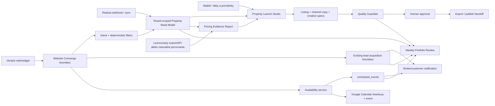

# Reality Smolko Property Revenue System v1

**Status:** PROPOSED / VALIDATE  
**Dátum:** 2026-09-03  
**Zákazník:** Reality Smolko  
**Repo baseline:** `origin/main` @ `86a6ba3c6`  
**Autorita:** customer-discovery call s p. Smolkom + audit aktuálneho repozitária  
**Implementačný stav:** návrh; tento dokument neautorizuje zmenu runtime, databázy ani produkcie

**Register produkčných blokátorov:** [Reality Smolko — blocking conditions](../briefs/reality-smolko-production-blockers-2026-09-04.md)  
**Prod data overlay (riadky ≠ kód):** [v1 data overlay](./reality-smolko-property-revenue-system-v1-data-overlay.md)

## 1. Executive summary

Najrýchlejšia cesta k hodnote nie je nový samostatný „AI generátor inzerátov“. Revolis už má generovanie textu, Quality Guardian, bannerové špecifikácie, kostru microsite, Realvia ingest a kalendárové udalosti. Chýba jeden riadený pracovný tok, ktorý z údajov nehnuteľnosti vytvorí **schválený Property Launch Pack**.

Navrhovaný produkt má tri zákaznícke povrchy nad jedným tenant-scoped základom:

1. **Property Launch Studio** — pripraví štruktúru inzerátu, texty pre kanály, médiá, kontrolu faktov a finálny balík na publikovanie.
2. **Pricing Evidence Report** — oddelí očakávanie majiteľa od dátovo podloženej odporúčanej ceny a dá maklérovi profesionálny report pre cenový rozhovor.
3. **Website Concierge** — verejný AI asistent vyhľadá vhodné nehnuteľnosti, kvalifikuje záujem a bezpečne odovzdá alebo rezervuje obhliadku.

Štvrtým, ľahkým povrchom je **Weekly Portfolio Review** pre poradu: rizikové ceny, nekompletné inzeráty, chýbajúci marketing, nové dopyty a najbližšie obhliadky.

Odporúčané poradie je zámerné. Launch Studio rieši najväčšiu explicitnú bolesť a stojí na existujúcom kóde. Concierge pôjde do verejnej produkcie až po overení Realvia tenant scoping, dostupnosti kalendára, ochrany osobných údajov a spoľahlivého odovzdania maklérovi.

## 2. Vstupy z discovery

### 2.1 Potvrdené zákazníkom

- Najviac času makléri míňajú prípravou marketingu okolo inzerátov a rozhodovaním, akú štruktúru má inzerát mať.
- Správne nastavenie ceny je pre rýchlosť predaja rozhodujúce.
- Predávajúci majú k nehnuteľnosti citovú väzbu a často odvodzujú cenu od nesprávne porovnateľných prípadov.
- P. Smolko pracuje pri oceňovaní s viacerými nástrojmi: riešenie Realitnej únie, RealityMap a ValuoProfi.
- Tím má týždennú poradu.
- Pôvodný chatbot cez Realvia po nasadení novej verzie prestal fungovať.
- Pôvodný chatbot vedel rozlíšiť prenájom/predaj a dom/byt/pozemok, vyfiltrovať ponuku, zachytiť záujem o obhliadku, pracovať s Google kontaktmi/kalendárom a informovať príslušného makléra.

### 2.2 Neoverené alebo chýbajúce vstupy

Nasledujúce tvrdenia sa nesmú zmeniť na verejný claim ani integračný záväzok, kým nebudú overené:

| Vstup | Stav | Potrebný dôkaz |
|---|---|---|
| Presný názov a integračné možnosti softvéru Realitnej únie | `UNKNOWN` | názov produktu, screenshot/export/API dokumentácia |
| RealityMap stojí 5 EUR mesačne | `CLIENT_REPORTED` | aktuálna faktúra alebo oficiálny cenník |
| Konkrétne slovenské kriminálne a lokalitné dáta vo ValuoProfi | `PARTIALLY_VERIFIED` | ukážkový slovenský report a licenčný rozsah |
| Možnosť automatického použitia dát RealityMap/ValuoProfi | `UNKNOWN` | export/API podmienky a súhlas poskytovateľa |
| Presný spôsob poruchy pôvodného Realvia chatbota | `UNKNOWN` | URL, pôvodný flow, log/error, kontakt na dodávateľa |
| Printscreeny, na ktoré discovery odkazuje | `MISSING` | opätovné priloženie originálov |
| Pravidlá dostupnosti jednotlivých maklérov | `UNKNOWN` | kalendáre, pracovné hodiny, dĺžka a buffer obhliadky |

### 2.3 Externý benchmark, nie zdroj pravdy

- RealityMap verejne opisuje porovnávanie ponúk, historické dáta a reporty pre aktuálny trh, históriu a výnosnosť. To potvrdzuje potrebu porovnateľných dôkazov, nie oprávnenie ich dáta kopírovať.
- ValuoProfi verejne komunikuje výber podobných nehnuteľností, úpravu koeficientov maklérom a brandovaný grafický report. To je vhodný benchmark pre UX cenového rozhovoru.
- Žiadny z týchto produktov nebude scrapovaný. Revolis použije len licencované API/exporty, zákazníkom dodané podklady alebo vlastné overené zdroje.

## 3. Produktový cieľ

Maklér má z jednej nehnuteľnosti do 20 minút vytvoriť:

- štruktúrovaný a fakticky skontrolovaný inzerát,
- odporúčanú cenovú pozíciu s jasným pôvodom dôkazov,
- kanálové texty a kreatívne podklady,
- profesionálny balík pre majiteľa,
- bezpečne publikovateľný výstup po ľudskom schválení.

Záujemca na webe má do dvoch minút:

- dostať relevantné aktívne ponuky,
- rozumieť, že komunikuje s AI,
- po prejavení záujmu odovzdať len potrebné kontaktné údaje,
- vybrať overený termín alebo požiadať o spätné zavolanie,
- dostať potvrdenie a správny maklér má dostať kontext.

## 4. Rozsah v1

### 4.1 V rozsahu

- vedený intake faktov nehnuteľnosti,
- kontrola úplnosti a zákaz vymýšľania faktov,
- návrh štruktúry, titulkov a portálového textu,
- FB/IG/e-mailové výstupy,
- cenový dôkazový list a argumentácia pre majiteľa,
- manuálny alebo licencovaný import porovnateľných údajov,
- read-only vyhľadávanie aktívnych ponúk pre verejný concierge,
- kvalifikácia záujmu a odovzdanie maklérovi,
- neskôr rezervácia obhliadky cez overenú dostupnosť,
- týždenný akčný prehľad portfólia.

### 4.2 Mimo rozsahu v1

- autonómne publikovanie bez ľudského schválenia,
- automatické určenie znaleckej hodnoty,
- scraping konkurentov alebo platených databáz,
- autonómne menenie ceny,
- generický CRM copilot alebo nový produktový Memory Engine,
- verejný prístup chatbota k interným poznámkam, pipeline alebo osobným údajom,
- LLM ako autorita pre cenu, oprávnenie, dostupnosť termínu alebo výber tenant dát.

## 5. Cieľová architektúra



### 5.1 Rozhodujúce hranice

| Hranica | Autorita | Pravidlo |
|---|---|---|
| Fakty o ponuke | tenant-scoped `properties` + potvrdenie makléra | LLM ich nesmie dopĺňať odhadom |
| Cena | označené dôkazy + profesionálny úsudok makléra | AI vysvetľuje; nevyhlasuje znaleckú hodnotu |
| Marketingový text | generátor + schválený kontrakt | musí prejsť Guardianom a človekom |
| Dostupnosť ponuky | aktuálny Realvia/property stav | chatbot nesmie ukázať neaktívnu ponuku |
| Dostupnosť termínu | kalendár + serverová validácia pri potvrdení | LLM nikdy nevymýšľa slot |
| Priradenie makléra | listing broker alebo explicitné routing pravidlo | nie voľná halucinovaná voľba |
| PII | existujúca lead acquisition hranica | zbierať až pri kontakte/obhliadke a len minimum |
| Publikovanie | človek s oprávnením | `publishBlocked=true` až do schválenia |

## 6. Povrch A — Property Launch Studio

### 6.1 UX tok

Jedna obrazovka, šesť krokov:

1. **Fakty** — typ, transakcia, lokalita, dispozícia, plochy, stav, vybavenie, cena, fotografie a explicitné lokálne charakteristiky.
2. **Cena** — očakávanie majiteľa, odporúčané pásmo, porovnania, úpravy a dôvera v podklady.
3. **Inzerát** — tri titulky, portálový text, chýbajúce údaje a odporúčania.
4. **Kampane** — sociálne siete, e-mail, bannery a microsite špecifikácia.
5. **Kontrola** — Quality Guardian, drift ceny/plochy, neoverené tvrdenia a brand kontrola.
6. **Schváliť/exportovať** — ľudské potvrdenie, verzia výstupu a export pre konkrétny kanál.

Odporúčaný layout:

- horný progress stepper,
- vľavo štruktúrované vstupy a úplnosť,
- uprostred profesionálny živý náhľad,
- vpravo „Evidence & Guardian“ rail s pôvodom údajov, varovaniami a blokermi,
- existujúci Slate Horizon / Enterprise Blue vizuálny systém; vlastná značka Reality Smolko v exporte,
- ValuoProfi slúži ako benchmark úrovne informácie, nie ako predloha na kopírovanie trade dress.

### 6.2 Čo sa má znovu použiť

- `apps/crm/src/lib/ai/listing-content.ts`
- `apps/crm/src/app/api/ai/listing-content/route.ts`
- `apps/crm/src/app/(dashboard)/inzerat-generator/page.tsx`
- `apps/crm/src/components/listing-generator/ListingGeneratorClient.tsx`
- `apps/crm/src/lib/capabilities/listing-generator/generate.ts`
- `apps/crm/src/lib/capabilities/quality-guardian/review.ts`
- `apps/crm/src/lib/capabilities/banner-factory/build.ts`
- `apps/crm/src/lib/capabilities/property-microsite/build.ts`
- existujúci Realvia row-to-listing adapter
- `apps/crm/src/lib/slate-horizon-theme.ts`
- `apps/crm/src/lib/price-trail/engine.ts`
- `apps/crm/src/lib/price-trail/negotiation-script.ts`
- `apps/crm/src/app/api/price-trail/route.ts`
- `apps/crm/src/app/api/cron/price-trail-sync/route.ts`
- `apps/crm/src/components/price-trail/PriceChart.tsx`
- `apps/crm/src/components/price-trail/PriceTrailPanel.tsx`
- `apps/crm/src/hooks/use-price-trail.ts`
- `apps/crm/src/types/price-trail.ts`
- `apps/crm/supabase/migrations/20260426121525_price_trail.sql`

### 6.3 Potrebné zjednotenie

Dnes existujú dve cesty: manuálny AI generátor a deterministická capability pipeline nad Realvia údajmi. V1 musí zaviesť jeden kanonický vstupný kontrakt a jeden Guardian verdict. Samostatný tretí generátor je zakázaný.

Banner Factory a microsite dnes vytvárajú špecifikácie, nie publikované assety. UI ich musí označovať ako návrh až do reálneho render/export kroku.

Price-trail vrstva sa nesmie postaviť tretíkrát. Jej engine, API, sync, negotiation script a UI sa majú buď znovu použiť, alebo explicitne vyradiť v Integration Reporte. Existencia týchto modulov však dokladá iba schopnosť kódu, nie dostupnosť produkčných dát.

## 7. Povrch B — Pricing Evidence Report

### 7.1 Účel

Report nemá povedať „toto je pravá cena“. Má maklérovi umožniť viesť dôkazový rozhovor:

- čo chce majiteľ,
- čo ukazujú porovnateľné ponuky alebo transakčné podklady,
- čím sa predmetná nehnuteľnosť od porovnaní líši,
- aké cenové pásmo odporúča maklér,
- aké riziko prináša vyššia štartovacia cena,
- kedy sa cena znovu vyhodnotí.

### 7.2 Produkčná dátová pravda a blokujúca otázka

Produkčný DB audit oznámený 2026-09-04 zistil:

| Objekt | Produkčný stav | Dôsledok |
|---|---:|---|
| `properties` | 133 riadkov; 132 Reality Smolko | Concierge má použiteľný inventár, ak prejde tenancy a freshness gate. |
| `portal_listings` | 0 riadkov | Price-trail sync nemá zdrojové listingy. |
| `property_price_trail` | 0 riadkov | Doba na trhu, poklesy ceny a seller-motivation nemajú produkčný dôkaz. |

Tieto počty sú dôkaz z produkčnej kontroly dodaný reviewerom; pred implementáciou sa musia znovu zaznamenať s časom, projekt ref a vykonaným SQL dotazom.

**Blokujúca otázka Fázy 2:** Odkiaľ získame legálne a spoľahlivo porovnateľné ponuky, cenové zmeny a dobu na trhu, keď `portal_listings` má nula riadkov?

Kým nie je vybraný a overený zdroj, automatizované tvrdenia o dobe na trhu, nepredaných ponukách, cenových poklesoch a seller motivation sú `DO_NOT_PUBLISH`. Manuálny/licencovaný evidence input zostáva jediná povolená cesta. `properties` nie sú náhradou za porovnateľné dáta ani historický price trail.

Existujúci price-trail engine sa zachová ako cieľový konzument budúceho dátového zdroja. Jeho prázdne tabuľky sa nesmú prezentovať ako fungujúca produkčná inteligencia.

### 7.3 Minimálny dátový model bez migrácie

V prvom reze môže byť report zostavený zo vstupného kontraktu bez persistencie nového konceptu:

```ts
type PricingEvidenceInput = {
  subjectPropertyId: string;
  ownerExpectation?: { amount: number; currency: "EUR" };
  brokerRecommendation?: { min: number; max: number; currency: "EUR" };
  comparables: Array<{
    source: "MANUAL" | "LICENSED_EXPORT" | "LICENSED_API";
    sourceLabel: string;
    externalId?: string;
    price: number;
    areaM2?: number;
    location: string;
    propertyType: string;
    observedAt?: string;
    adjustments?: Array<{ label: string; direction: "UP" | "DOWN"; note: string }>;
  }>;
  brokerCommentary: string;
  evidenceAsOf: string;
};
```

Kontrakt je návrh. Ak má byť report uložený, verzovaný alebo auditovaný ako nový DB koncept, platí STOP a samostatné founder `GO` pre databázovú zmenu.

### 7.4 Povinné označenia

- zdroj a dátum každého porovnania,
- ponuková vs. realizovaná cena, ak je známe,
- neistota a chýbajúce dáta,
- „informatívny podklad pre cenové odporúčanie, nie znalecký posudok“,
- žiadne tvrdenie o kriminalite alebo lokalite bez dostupného, licencovaného a časovo označeného dôkazu.

## 8. Povrch C — Website Concierge

### 8.1 Odporúčaný produktový tok

1. Verejný návštevník dostane oznámenie, že komunikuje s AI.
2. Asistent zistí zámer: kúpa/prenájom, typ, lokalita, cenové pásmo, izby a ďalšie deterministické filtre.
3. Server vyhľadá len aktívne ponuky danej agentúry.
4. Asistent ukáže malé množstvo relevantných výsledkov s odkazom na detail.
5. Ak nič nesedí, ponúkne uloženie dopytu alebo kontakt človeka; nevymyslí ponuku.
6. Pri záujme vytvorí/aktualizuje lead cez existujúcu acquisition hranicu.
7. V bezpečnom MVP ponúkne spätné zavolanie. Pri otvorení booking gate načíta kalendárové sloty, pri potvrdení ich znovu overí a až potom vytvorí udalosť.
8. Zákazník dostane potvrdenie a listing broker alebo routingom určený maklér dostane ponuku, kontakt a stručný kontext.

### 8.2 Technické pravidlá

- Nepoužiť `assistant-chat.ts`: ide o interného asistenta nad konkrétnym leadom, nie verejnú anonymous hranicu.
- Nepoužiť lokálne `NexusAiChatSettings` ako produkčnú konfiguráciu.
- Nechať LLM len na prirodzené porozumenie a formuláciu odpovede. Filtre, tenancy, oprávnenia, aktívnosť ponuky a sloty sú deterministické.
- Žiadny „browser celého webu“ v prvej verzii. Zdroj odpovedí tvorí štruktúrovaný inventár a malý schválený FAQ snapshot. Tým sa odstráni krehkosť pôvodného crawlera.
- Anonymous session nesmie mať prístup k interným poznámkam, iným agentúram, histórii leadov ani neverejným properties poliam.
- Pred verejným testom: rate limit, anti-abuse/CAPTCHA podľa rizika, timeout, bezpečný fallback na človeka a observabilita bez logovania zbytočného PII.
- Chat transcript sa v prvom reze neukladá. Lead vzniká až po prejavení záujmu a minimálnom kontakte.

### 8.3 Booking kontrakt

Produkčný DB audit (re-check 2026-09-04, projekt `ypgajkhqtbriqqmyawyv`) potvrdil:

| Kontrola | Výsledok |
|---|---|
| `to_regclass('public.scheduled_events')` | **null** — tabuľka v produkcii **neexistuje** |
| `schema_migrations` version `20260527143000` (`event_scheduler_phase1`) | **záznam existuje** |

Teda **migračný drift**: história tvrdí aplikovanie, objekt chýba. Booking stále nemá kam bezpečne zapísať CRM udalosť. Nesmie sa označiť Gate D / SMO-B07 ako `DONE` len podľa histórie.

**Blokujúca podmienka Fázy 5:** pred booking preview vyriešiť drift (RCA + Founder DB `GO`), potom aplikovať alebo znovu overiť DDL z `20260527143000_event_scheduler_phase1` cez Supabase Dashboard pre projekt `ypgajkhqtbriqqmyawyv`, dokázať existenciu tabuľky, RLS, policy, indexov, nulový cross-tenant prístup a zosúladenú evidenciu. Aplikovanie DB migrácie vyžaduje samostatné founder DB `GO`; tento dokument ho neudeľuje. Detail: register SMO-B07 + `docs/reports/2026-09-04-smolko-blocking-register-ingest.md`.

Najrýchlejší bezpečný variant po splnení tejto podmienky nepoužíva nový koncept dočasných holdov:

1. načíta voľné okná cez úzko oprávnené Google Calendar free/busy,
2. ukáže odvodené sloty podľa pracovných hodín, dĺžky a bufferov,
3. pri potvrdení znovu načíta free/busy,
4. zapíše tenant-scoped `scheduled_events`,
5. vytvorí Google event idempotentným serverovým volaním,
6. uloží externé ID/link a odošle potvrdenie,
7. pri čiastočnom zlyhaní ukáže callback fallback a incident zachytí na retry.

Ak sa v reálnom pilote preukáže konflikt súbežných rezervácií, až potom sa navrhne perzistentný hold/locking model so samostatným DB schválením.

## 9. Povrch D — Weekly Portfolio Review

Porada nemá byť ďalšia generatívna funkcia. Má deterministicky zoradiť výnimky:

- nové alebo zmenené ponuky bez hotového Launch Packu,
- ponuky s chýbajúcimi kritickými faktmi,
- Guardian blokery,
- ceny mimo odporúčaného pásma alebo bez čerstvého dôkazu,
- ponuky bez aktivity podľa schváleného časového prahu,
- nové dopyty bez odpovede,
- obhliadky na nasledujúci týždeň a neuzavreté follow-upy.

V0 je read-only pohľad/export nad existujúcimi údajmi. Žiadny nový task engine ani organizačný AI OS nie je potrebný.

## 10. Dáta, bezpečnosť a tenancy

### 10.1 Zdroj pravdy

- Realvia/`properties`: stav a fakty ponuky.
- Maklér: citlivé alebo subjektívne vlastnosti, úpravy porovnaní, odporúčaná cena a finálne schválenie.
- Licencovaný provider/export: externý porovnateľný dôkaz.
- Google Calendar: reálna dostupnosť a externá udalosť.
- `scheduled_events`: Revolis evidencia CRM udalosti.
- Lead acquisition pipeline: kontakt a routing.

### 10.2 Blokujúci audit pred verejným concierge

Realvia worker musí mať všetky lookup/update operácie viazané na `agency_id`. Globálny match podľa `source_id` bez tenantu blokuje verejný concierge.

**CODE (2026-09-04):** [PR #522](https://github.com/onlinovosk-bit/RealitkaAI/pull/522) merged (`e574cbede`) — scoped upsert/delete podľa `agency_id` + `source_system` + `source_id`. To je `CODE_PRESENT`, **nie** `PROD_READY` / SMO-B04 PASS.

**PROD stále chýba:** cross-tenant negative test na živej DB + active/freshness contract. Až potom Gate C.

### 10.3 PII a súhlas

- Pred filtrovaním ponúk netreba meno, e-mail ani telefón.
- Pri žiadosti o kontakt/obhliadku sa zobrazí účel spracovania, prevádzkovateľ, retention a odkaz na privacy notice.
- Súhlas na marketing sa nesmie spojiť s nevyhnutným spracovaním rezervácie.
- Verejný bot musí jasne oznámiť AI interakciu a vždy ponúknuť cestu k človeku.

## 11. E-mail a doménový prístup Reality Smolko

### 11.1 Zakázaná cesta

Nevyžiadať ani neprijímať existujúce heslo k `office@realitysmolko.sk` cez SMS, e-mail alebo chat. Websupport aktuálne heslo nezobrazuje; vlastník ho môže iba zmeniť. Existujúca stará IMAP cesta v repe navyše ukladá heslo v integračnom JSON a nie je cieľovým produkčným riešením.

### 11.2 Odporúčaná cesta pre pilot

1. P. Smolko vytvorí menovaný, odvolateľný Websupport prístup iba k potrebnej e-mailovej službe, alebo sa vykoná 15–20 minútový screenshare s ním.
2. V administrácii sa overí existencia `office@realitysmolko.sk` a nastaví presmerovanie na vyhradenú Smolko-controlled Gmail/Google Workspace schránku. Existujúca mailbox schránka môže ponechať kópiu správ.
3. V Gmaili sa vytvorí label/filter `Revolis` len pre správy určené na spracovanie.
4. Revolis sa autorizuje existujúcou OAuth pull cestou iba s `gmail.readonly`; žiadne IMAP heslo.
5. Nastavia sa Preview env/secrets, vykoná smoke test a 24–48 hodín paralelného behu s porovnaním počtov a deduplikácie.
6. Až po úspechu sa rozhodne o produkčnom cutoveri. Pôvodné doručovanie sa nevypína naslepo.

### 11.3 Dlhodobá cesta

Forwarding je najrýchlejší pilot, ale môže mať doručovacie/DMARC okrajové prípady. Stabilnou koncovkou je mailbox na poskytovateľovi s OAuth/API, napríklad Google Workspace na vlastnej doméne, ak to zákazník schváli. Migrácia mailu nie je podmienkou prvého Launch Studio pilotu.

## 12. Prevádzkové a degradačné režimy

| Zlyhanie | Bezpečný výsledok |
|---|---|
| Realvia sync je starý/neistý | nezobraziť ponuku ako aktuálnu; ponúknuť kontakt človeka |
| Provider ceny nie je dostupný | manuálny evidence input; žiadna predstieraná automatická valuácia |
| LLM zlyhá | zachovať vstup, ponúknuť retry; nič nepublikovať |
| Guardian hlási kritický drift | zablokovať schválenie/export |
| Google Calendar zlyhá | nevytvárať falošné potvrdenie; callback request |
| Notifikácia makléra zlyhá | retry + viditeľný stav; zákazník nedostane nepravdivé potvrdenie |
| Nie je vhodná ponuka | priznať nulový výsledok a zachytiť dopyt iba so súhlasom |

## 13. Observabilita a metriky

### Launch Studio

- medián času od otvorenia property po schválený Launch Pack,
- podiel výstupov schválených bez druhej generácie,
- počet a typ Guardian blockerov,
- podiel ponúk s kompletnými kritickými faktmi,
- podiel ponúk publikovaných do 24 hodín od intake.

### Pricing

- podiel prípadov s označeným zdrojom a dátumom dôkazu,
- rozdiel owner expectation vs. broker recommendation,
- počet revízií ceny a čas do dohody,
- days-on-market podľa zvolenej cenovej pozície — až keď sú dáta spoľahlivé.

### Concierge

- kvalifikované sessions / sessions,
- zobrazenie ponuky a preklik na detail,
- kontakt alebo booking / kvalifikovaná session,
- handoff rate a čas do reakcie človeka,
- nulové cross-tenant úniky a nulové dvojité rezervácie,
- fallback/error rate podľa kroku.

### Týždenná porada

- čas prípravy pod 15 minút,
- počet otvorených výnimiek a ich vek,
- akcie uzavreté do ďalšej porady.

## 14. Release gates

### Gate A — Launch Studio pilot

- 5 reálnych Reality Smolko ponúk,
- maklérom potvrdené povinné polia a tone-of-voice,
- existujúci generátor a capability pipeline majú jeden kontrakt,
- Guardian blokuje vymyslené fakty a drift ceny/plochy,
- export je jasne označený ako schválený alebo draft.

### Gate B — Pricing report pilot

- ukážkový report každého používaného providera,
- právne/licenčne dovolený vstupný spôsob,
- zvolená odpoveď na otázku zdroja porovnaní, cenovej histórie a doby na trhu,
- aktuálny produkčný row-count dôkaz pre `portal_listings` a `property_price_trail`,
- zdroj, dátum, typ ceny a neistota sú viditeľné,
- p. Smolko schváli argumentačnú štruktúru na troch prípadoch.

### Gate C — Concierge read-only preview

- tenant-scoped Realvia read model a cross-tenant test,
- len aktívne ponuky, čerstvosť dát viditeľná systému,
- schválené FAQ a fallback,
- AI disclosure, privacy notice, rate limit a abuse test,
- bez autonómnej rezervácie.

### Gate D — Booking production

- migrácia `20260527143000_event_scheduler_phase1` je **skutočne** v produkcii (tabuľka existuje) po samostatnom DB `GO`; história a objekt sú zosúladené (drift vyriešený),
- `scheduled_events` existuje, má zapnuté RLS a tenant policy prešla negatívnym testom,
- pravidlá kalendárov, duration/buffer/timezone,
- least-privilege OAuth a úspešná platform verification, ak ju provider vyžaduje,
- free/busy recheck pri potvrdení,
- idempotency a failure recovery,
- zákaznícke aj maklérske potvrdenie otestované,
- callback fallback.

## 15. Kolízie a zakázané skratky

- Nevytvárať paralelný generátor inzerátov.
- Nenasadiť interný lead assistant ako anonymous chatbot.
- Neznovuotvárať produktový Memory Engine ani Agent OS pre túto funkciu.
- Neukladať e-mailové heslo do `profile_integrations.config`.
- Nescrapovať RealityMap alebo ValuoProfi.
- Neprisľúbiť automatické slovenské kriminálne dáta bez overenia datasetu a licencie.
- Nepublikovať text, cenu alebo asset bez človeka.
- Nevytvárať DB tabuľku pre chat session, report alebo hold bez explicitného DB `GO`.

## 16. Implementačný vstup po schválení

Pred zmenou aplikačného kódu sa podľa pravidiel repozitára pripravia a schvália:

1. Build Order,
2. Integration Report voči živým povrchom,
3. premortem,
4. implementačný plán a Build Package,
5. explicitné `GO` pre runtime a samostatné `GO` pre prípadnú DB zmenu.

Detailné poradie a acceptance gates sú v `docs/briefs/reality-smolko-production-roadmap-2026-09-03.md`.

## 17. Otvorené founder/customer rozhodnutia

1. Má V0 exportovať brandovaný PDF report, alebo stačí kvalitný obrazovkový/print view?
2. Ktorý provider je licenčný zdroj porovnaní v prvej verzii: manuálny vstup, export, alebo API?
3. Má chatbot v prvom release iba zachytiť callback, alebo je kalendárová rezervácia povinná pre pilot?
4. Kto je fallback maklér a ako sa routuje ponuka bez priradeného brokera?
5. Ktoré FAQ odpovede sú schválené na verejné použitie?
6. Aká je retention kontaktu a prípadného chatového kontextu?

## 18. Referencie

- RealityMap, verejný opis funkcií: <https://realitymap.sk/>
- ValuoProfi, verejný opis porovnaní a brandovaného reportu: <https://valuo.sk/valuo-profi>
- Valuo API a rozsah výstupov: <https://valuo.sk/cennik-api>
- Google Calendar OAuth scopes: <https://developers.google.com/workspace/calendar/api/auth>
- Google Calendar free/busy: <https://developers.google.com/workspace/calendar/api/v3/reference/freebusy/query>
- Google Calendar event insert: <https://developers.google.com/workspace/calendar/api/v3/reference/events/insert>
- Websupport — aliasy a presmerovanie: <https://www.websupport.sk/podpora/kb/aliasy-a-presmerovania-e-mailov/>
- Websupport — delegovanie oprávnení: <https://www.websupport.sk/podpora/kb/sprava-opravneni-uzivatelov/>
- Websupport — zmena hesla mailboxu: <https://www.websupport.sk/podpora/kb/zmena-hesla-do-emailovej-schranky/>
- Websupport — nastavenia mailboxu: <https://www.websupport.sk/podpora/kb/nastavenia-e-mailovej-schranky/>
- EU AI Act, Regulation (EU) 2024/1689, čl. 50: <https://eur-lex.europa.eu/eli/reg/2024/1689/oj?locale=en>
- GDPR, Regulation (EU) 2016/679, čl. 5 a 13: <https://eur-lex.europa.eu/legal-content/EN/TXT/?uri=CELEX:32016R0679>
- EDPB, základné princípy GDPR: <https://www.edpb.europa.eu/topics/key-gdpr-concepts/basic-principles_en>
