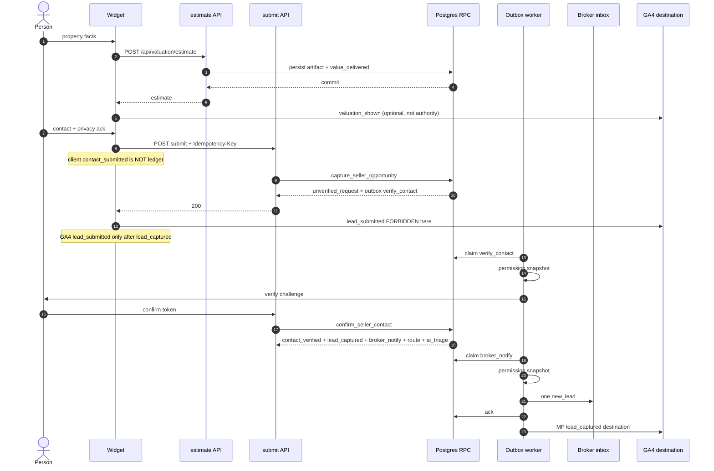
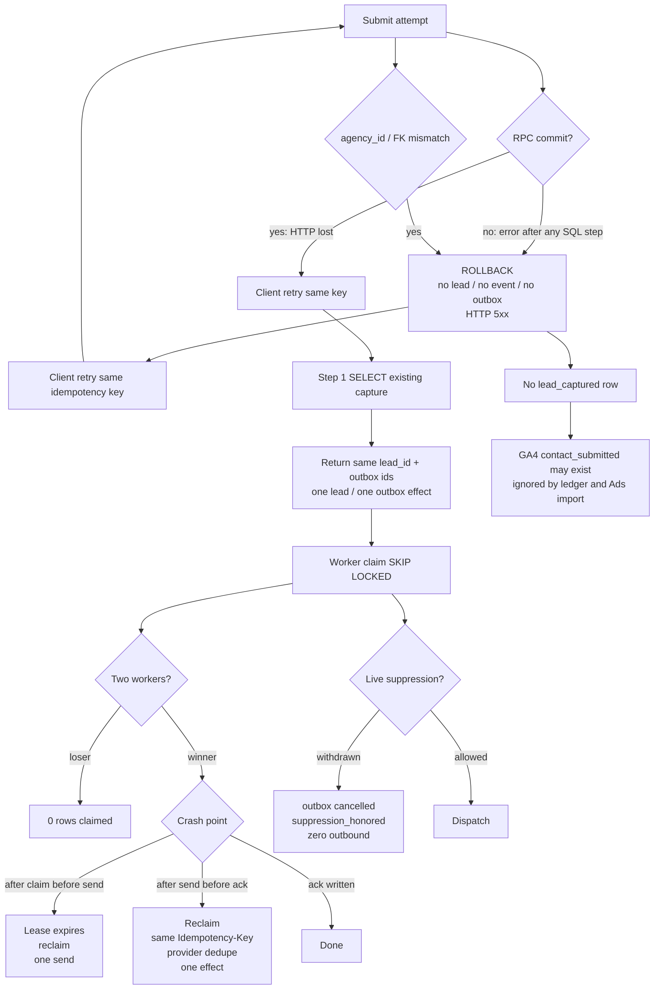

# Seller Trust Factory — event reliability contract (P0)

> **Status:** proposed contract. Not production fact. Not a runtime migration.
> Implementation requires a separate GO. This document is the source of truth
> for *what must be true* before paid traffic scales on `/odhad`.
>
> **Unapproved drafts** (`revolis-seller-trust-factory-l99.md`, technical
> addendum, `memory/seller-trust-factory.md`) were read as intent only. They
> are **not** SoT. Claims below are verified against worktree code at
> `5d6500106a67a864b049dc372ee0a2d6be793c6f`.
>
> **Business KPI limits** (CAC, cost-per-consultation, conversion %, volume
> targets): `UNKNOWN — HUMAN DECISION`. Founder has not specified them here.

---

## 0. Non-negotiables

1. A **client event is never authority** for business conversion, consent,
   routing, or Ads reconciliation.
2. **GA4 is a destination**, not the ledger. Browser `gtag` may be lossy,
   blocked, or optimistic. It must not mint `lead_captured`.
3. **Broker notification is deterministic** and **independent of AI triage**.
   Triage failure must not suppress the broker `new_lead` dispatch.
4. **Permission / suppression snapshot** is checked **immediately before every
   outbound dispatch** (email, SMS, phone queue, Ads offline ping, push).
5. Event payload contains **no raw PII** (no name, email, phone, address line,
   raw IP). Identifiers are `subject_id` / HMAC / tenant-scoped IDs.
6. **No business-critical `void` side effects** on the conversion path.
   Fire-and-forget is allowed only for non-authoritative telemetry.
7. Failed submit **does not** create `lead_captured`.
8. Unverified request **must not** be called warm or BAWSO.
9. Rollback **preserves audit data**. Never `DROP TABLE`. Never delete
   evidence. Compensating `DELETE` of a lead/consent row is forbidden.
10. Cross-tenant transition or FK mismatch **fails closed**.

---

## 1. Verified current truth (this worktree)

These are defects relative to this contract, not accusations of intent.

### 1.1 Capture is not atomic

`apps/crm/src/app/api/valuation/submit/route.ts`:

1. `leads.insert(...)` then `.select(...).single()`.
2. Separate `lead_consents.insert(...)`.
3. On consent error: compensating `leads.delete().eq("id", inserted.id)` then
   HTTP 500.
4. On success: `void runInboundLeadTriageAndNotify(...)` then HTTP 200.

A crash or timeout between (1) and (2) leaves a lead **without** consent
receipt. A crash after (2) before (4) leaves a lead **without** durable
notify/outbox. Compensating delete **destroys** the lead row; if consent had
been inserted, `lead_consents.lead_id … ON DELETE CASCADE`
(`apps/crm/supabase/migrations/20260722120000_sandbox_gdpr_consent.sql`)
would also destroy consent evidence.

There is **no** `capture_seller_opportunity` RPC. There is **no** submission
idempotency key. Retry after a lost HTTP 200 creates a second lead:
`buildValuationLeadInsert` assigns `id: crypto.randomUUID()`
(`apps/crm/src/lib/valuation/lead-mapper.ts`) and `idx_leads_email` is a
non-unique index, not a uniqueness constraint.

Sandbox path inserts `sandbox_submissions` (no contact PII) and returns
`leadId: crypto.randomUUID()` that is **not** a real lead. That random id
must never be treated as `lead_captured`.

### 1.2 Consent model is a boolean, not a receipt

`apps/crm/src/lib/valuation/consent-mapper.ts` writes:

- `lead_id`, `tenant_slug`, `privacy_policy_version`, `acknowledged_at`,
  `marketing_opt_in`.

Missing from the live row: purpose, channel, legal basis, wording hash,
evidence hash, recipient, expiry, withdrawal, suppression pointer. Privacy
ack and marketing opt-in share one insert; service-contact permission is
**not** a distinct purpose.

### 1.3 Notification is coupled to AI triage (fire-and-forget)

`apps/crm/src/lib/acquire/inbound-lead-triage.ts`:

- Comment: "Best-effort post-insert triage + new_lead notification. Never throws."
- Early return if `ai_triage_at` is set (skips **notification** too).
- Early return if `triageLeadBatches` returns empty — **no notification**.
- `createNotification` runs only after a successful triage update.
- `logAiRecommendation(...)` is itself fire-and-forget
  (`apps/crm/src/lib/moat-capture/log-ai-recommendation.ts`).
- Call site: `void runInboundLeadTriageAndNotify(...)` in submit route.

`apps/crm/src/lib/acquire/__tests__/inbound-lead-triage.test.ts` encodes the
coupling: triage engine failure is swallowed; notification is asserted only
on triage success. That is the opposite of this contract.

`apps/crm/src/lib/notifications/store.ts` inserts `routine_notifications`
without an idempotency key. Two workers / two retries → two `new_lead` rows.

### 1.4 GA4 is client `gtag`, not a ledger

Producer chain:

- `ValuationWidgetForm.tsx` → `lib/valuation/analytics.ts` →
  `lib/analytics/events.ts` → `lib/analytics/gtag.ts` → `window.gtag`.

Facts:

| Client event | When it fires | Authority? |
|---|---|---|
| `valuation_started` | widget mount | no |
| `step_completed` | local step change | no |
| `valuation_shown` | after estimate HTTP ok (variant B) or after submit ok (variant A) | no |
| `contact_submitted` | **before** `fetch("/api/valuation/submit")` | **no** — fires even if submit later fails |
| `lead_submitted` | after `res.ok && data.ok` | **still no** — destination only |
| `abandon` | unload | no |

`trackGaEvent` no-ops if `window.gtag` is missing. Ad blockers, SSR, and
consent-mode denial silently drop events. **None of these names are the
canonical business events in §3.**

### 1.5 Value persist is best-effort and not an event

`apps/crm/src/app/api/valuation/estimate/route.ts` computes a deterministic
estimate, then `persistValuationEstimate` which **must not fail the widget
response** (`apps/crm/src/lib/valuation/persist-estimate.ts`). Persist error
is logged; the client may still show a number. There is no
`value_delivered` ledger row.

Variant B preview does not require contact. Variant A gates estimate display
behind contact submit. Neither path writes this contract's events.

### 1.6 Acquisition connect: client tenant claim is ignored (correct pattern)

`apps/crm/src/app/api/acquisition/google/connect/route.ts`:

- `agency_id` / `customer_id` from the client body are **ignored**.
- "Auth context is the ONLY source of `agency_id`."
- `void parsed.data.agency_id` (and sibling `void`s) discard unused fields.
  That is **not** a business side effect.
- No live Google Ads API. Inserts `acquisition_accounts` as `PENDING`.
- Duplicate unique → HTTP 409.

**Reuse this authority rule** for seller capture: tenant comes from server
resolution (`resolveTenantRecord`), never from a client-supplied `agency_id`.
Client `agencySlug` is an input to **lookup**, not an authority token.

### 1.7 Other `void` / fail-open notes

| Location | What | Contract |
|---|---|---|
| `submit/route.ts` `void runInboundLeadTriageAndNotify` | business-critical notify | **forbidden** |
| `logAiRecommendation` `void (async () => …)` | telemetry | allowed only off conversion path |
| `connect/route.ts` `void parsed.data.*` | unused binding | allowed |
| `rate-limit.ts` DB error → `{ allowed: true }` | fail-open | capture path must **fail closed** once this contract is implemented |

---

## 2. Precise terms: request vs warm vs BAWSO

Draft L99 language is **not** SoT. This section is.

### 2.1 Unverified request (not warm, not BAWSO)

A person submitted contact details (or a service-contact intent) and the
server accepted an **unverified** `service_contact_requested` row.

Must **not** be labelled:

- warm lead
- warm opportunity
- BAWSO
- "hot"
- broker call-queue ready

Operational CRM status, if a row exists: `unverified_request`.

### 2.2 Contact-verified permissioned request (still not BAWSO)

`contact_verified` ∧ service-contact purpose granted ∧ not suppressed.

Still **not** warm: value, expectation (who / why / channel / when), intent,
and fit may be missing.

### 2.3 Warm seller opportunity (still not BAWSO)

All six dimensions are proven **and** the opportunity is eligible for a
broker queue. Broker has **not** yet accepted.

| Dimension | Required proof (server rows, not GA4) |
|---|---|
| Value | `value_delivered` with `value_artifact_id` (estimate/plan persisted or honest no-data artifact) |
| Trust | tenant/broker identity shown; methodology/limits attached to the artifact |
| Intent | declared timeline/reason **or** an allow-listed behavioral action stored as a first-party event |
| Expectation | stored channel, window, recipient, and reason the person asked for contact |
| Permission | `consent_receipt` for `service_contact` on that channel; not withdrawn/expired; suppression miss |
| Reachability + fit | `contact_verified` ∧ territory/property type in tenant coverage |

Missing **expectation** or **permission** → maximum `permissioned_nurture`.
Must not enter a phone queue as "hot".

### 2.4 BAWSO — Broker-Accepted Warm Seller Opportunity

**BAWSO** ⇔ warm seller opportunity ∧ event `broker_accepted`.

`broker_rejected` is a terminal branch for that broker assignment; it is
not BAWSO. Re-route may create a new `routed` with a new assignment id.

AI score, form count, email open, and `lead_submitted` in GA4 are
**forbidden** as BAWSO evidence.

---

## 3. Canonical state machine

Events below are the **only** conversion-grade names for this journey.
They live in the server ledger (`seller_business_events`). Client/GA4 names
map as destinations in §5, never as these rows.

```text
(none)
  → value_delivered
  → service_contact_requested
  → contact_verified
  → lead_captured
  → routed
  → broker_accepted | broker_rejected
  → appointment_proposed          (only from broker_accepted)
  → appointment_confirmed
  → appointment_held | no_show | cancelled
  → mandate_signed | lost
```

Side events (not conversion, still ledgered): `consent_updated`,
`suppression_honored`, `unsubscribe`, `complaint`, `identity_merge_requested`,
`outbox_dead_lettered`. They do not advance the happy path.

### 3.1 Allowed transitions

| From (opportunity status) | Event | To | Notes |
|---|---|---|---|
| `none` / anonymous session | `value_delivered` | `value_shown` | Repeatable if artifact version changes; each delivery is a new event, status stays `value_shown` until request |
| `value_shown` **or** `none` (variant A: value in same RPC as request) | `service_contact_requested` | `unverified_request` | Variant A may persist value artifact in the same transaction **before** this event |
| `unverified_request` | `contact_verified` | `contact_verified` | OTP / magic-link / confirmed-reply. Format validation of email/phone is **not** this event |
| `contact_verified` | `lead_captured` | `lead_captured` | Same transaction as verification is allowed; event order is strict |
| `lead_captured` | `routed` | `routed` | Requires tenant-owned territory + capacity; FK must match `agency_id` |
| `routed` | `broker_accepted` | `broker_accepted` | Actor = assigned broker or tenant owner |
| `routed` | `broker_rejected` | `broker_rejected` | Reason code required. Not BAWSO |
| `broker_accepted` | `appointment_proposed` | `appointment_proposed` | |
| `appointment_proposed` | `appointment_confirmed` | `appointment_confirmed` | Subject or broker confirm |
| `appointment_confirmed` | `appointment_held` | `appointment_held` | |
| `appointment_confirmed` | `no_show` | `no_show` | |
| `appointment_confirmed` **or** `appointment_proposed` | `cancelled` | `cancelled` | Who cancelled + reason |
| `appointment_held` | `mandate_signed` | `mandate_signed` | |
| any post-`lead_captured` except `mandate_signed` | `lost` | `lost` | Reason code required |
| any | illegal transition | **reject** | Ledger unchanged; write `transition_rejected` operational log, not a fake conversion event |

Illegal examples: `broker_accepted` without `routed`; `lead_captured`
without `contact_verified`; `mandate_signed` from `unverified_request`;
`routed` with `agency_id` ≠ lead `agency_id`.

### 3.2 Variant A vs B (ordering, not a second machine)

- **B (value first):** estimate route may emit `value_delivered` (anonymous,
  session-scoped). Submit later emits `service_contact_requested`.
- **A (contact first):** submit RPC may insert value artifact then
  `value_delivered` then `service_contact_requested` in **one** transaction.
  Client must not see a conversion event until the RPC commits.

---

## 4. Per-event contract

PII class on the **event payload** is always `none` or `pseudonymous`.
Contact PII lives in `leads` / person tables, never in the event JSON.

Retention for legal hold: `UNKNOWN — HUMAN DECISION`. Technical rule until
that decision: **append-only, no delete, no DROP**. Archive = copy to cold
storage + retain hash; original row stays or is moved with checksum, never
erased.

Idempotency key namespace is always `{agency_id}:{event_name}:{natural_key}`.

| Event | Producer | Authority | Idempotency key | Allowed from | Payload PII | Downstream | Failure policy |
|---|---|---|---|---|---|---|---|
| `value_delivered` | `POST /api/valuation/estimate` or capture RPC | Server estimate engine + persist **in the same transaction as the event** (today persist is best-effort — **gap**) | `{agency_id}:value_delivered:{session_id}:{artifact_version}` | `none`, `value_shown` | pseudonymous (`session_id`, `artifact_id`, band flags, `no_estimate`). No address line | ledger; optional GA4 MP `valuation_shown` destination | If artifact persist fails, **do not** emit the event; client may show honest error. No conversion |
| `service_contact_requested` | capture RPC only | Capture RPC | `{agency_id}:service_contact_requested:{idempotency_key}` | `none`, `value_shown` | pseudonymous. Channel/window/recipient **ids**. No phone/email | ledger; verification outbox; **not** broker call queue | RPC abort → no row, no event, no outbox |
| `contact_verified` | verify RPC (OTP/magic-link/inbound confirm) | Verify RPC | `{agency_id}:contact_verified:{subject_id}:{channel}` | `unverified_request` | pseudonymous | ledger; capture-confirm RPC may continue in same tx | Fail closed. Do not skip to `lead_captured` |
| `lead_captured` | confirm RPC (same tx as `contact_verified` allowed) | Confirm RPC | `{agency_id}:lead_captured:{lead_id}` | `contact_verified` | pseudonymous (`lead_id`, `subject_id`) | ledger; **deterministic broker notify outbox**; routing outbox | If this insert fails, tx abort. **Never** emit because GA4 `lead_submitted` fired |
| `routed` | routing worker / RPC | Router using tenant territory + capacity | `{agency_id}:routed:{lead_id}:{assignment_id}` | `lead_captured` | pseudonymous (`broker_id`, `assignment_id`) | ledger; broker inbox | Fail closed on FK/tenant mismatch. No silent default broker |
| `broker_accepted` | broker/owner action API | Authenticated broker in **same** `agency_id` | `{agency_id}:broker_accepted:{assignment_id}` | `routed` | none beyond ids | ledger; appointment outbox; **not** an Ads conversion unless legal GO | Duplicate accept → same event id returned |
| `broker_rejected` | broker/owner action API | same | `{agency_id}:broker_rejected:{assignment_id}` | `routed` | none + reason code | ledger; re-route outbox | Reason required. Not BAWSO |
| `appointment_proposed` | broker or system calendar adapter | CRM after successful propose write | `{agency_id}:appointment_proposed:{assignment_id}:{slot_id}` | `broker_accepted` | none + slot id | ledger; subject notify outbox (**permission check**) | Adapter fail → outbox retry, no duplicate propose event |
| `appointment_confirmed` | subject or broker confirm | CRM | `{agency_id}:appointment_confirmed:{appointment_id}` | `appointment_proposed` | none | ledger; reminder outbox | |
| `appointment_held` | broker outcome API | CRM (human attested) | `{agency_id}:appointment_held:{appointment_id}` | `appointment_confirmed` | none | ledger; Ads offline **destination** (not authority) | Client "I think we met" is not authority |
| `no_show` | broker outcome API | CRM | `{agency_id}:no_show:{appointment_id}` | `appointment_confirmed` | none | ledger | |
| `cancelled` | subject or broker | CRM | `{agency_id}:cancelled:{appointment_id}` | `appointment_proposed`, `appointment_confirmed` | none + actor role | ledger; suppression if subject cancelled contact | |
| `mandate_signed` | CRM mandate write | CRM document/mandate row | `{agency_id}:mandate_signed:{mandate_id}` | `appointment_held` | none | ledger; Ads offline destination | Highest-value conversion. Client event **cannot** mint this |
| `lost` | CRM | CRM | `{agency_id}:lost:{lead_id}:{reason_code}` | any post-`lead_captured` except `mandate_signed` | none + reason | ledger | |

**Failed submit does not create `lead_captured`:** if capture RPC rolls
back, zero events of this name exist. Client `contact_submitted` /
`lead_submitted` are irrelevant.

---

## 5. Authority model

```text
Consent / suppression  → authority for "may we send/call?"
CRM operational row    → authority for assignment, appointment, mandate
Event ledger           → authority for history, analytics, reconciliation
GA4 / Meta / Google    → destinations (Measurement Protocol / CAPI / ECL)
Browser gtag           → non-authoritative UX telemetry
```

Acquisition connect already ignores client `agency_id`. Seller capture must
do the same: `agencySlug` is resolved server-side; a mismatched body field
is ignored or the request is rejected. It is never written as tenant
authority.

**Ads / GA4 mapping (destination only):**

| Ledger event | Allowed destination name | When |
|---|---|---|
| `value_delivered` | `valuation_shown` | after RPC/commit, via Measurement Protocol **or** client — client is optional duplicate |
| `service_contact_requested` | `contact_submitted` | **server MP only** if used at all; today's pre-fetch gtag is not this |
| `lead_captured` | `lead_submitted` / ECL "lead" | only after confirm RPC commit |
| `appointment_held` | offline "qualified consultation" | only if legal basis exists — `UNKNOWN — HUMAN DECISION` |
| `mandate_signed` | offline "mandate" | `UNKNOWN — HUMAN DECISION` whether to send |

Destinations receive hashed identifiers per provider rules, never raw PII
in our ledger payload. Provider accept/reject is outbox ack, not a new
business event unless explicitly mapped.

---

## 6. Atomic RPC boundary

Two RPCs. Both are **single Postgres transactions**. No compensating
DELETE. No multi-statement client orchestration.

### 6.1 `capture_seller_opportunity`

**When:** authenticated-as-system submit after tenant resolve + fail-closed
rate limit + schema validation.

**Atomic set (all or nothing):**

1. Lead / opportunity row (`status = unverified_request`) + property facts
2. Permission receipt(s) (privacy notice ack, `service_contact` purpose,
   optional `nurture`/`marketing` as **separate** rows)
3. Service-contact request (channel, window, recipient, reason)
4. Business event(s): `value_delivered` if artifact written in this tx;
   always `service_contact_requested` on success
5. Outbox row(s): `verify_contact` (if unverified) and/or
   `analytics_destination` — **not** `broker_call_queue`

**Not in this RPC:** `lead_captured`, `routed`, broker accept, AI triage
result as a gate.

#### Exact SQL step order (abort = full rollback)

```text
BEGIN ISOLATION LEVEL READ COMMITTED
  -- unique (agency_id, idempotency_key) is the retry fence

  1. SELECT id FROM seller_captures
       WHERE agency_id = :agency_id AND idempotency_key = :key
     IF found → return existing capture_id, lead_id, event_ids, outbox_ids
                (no new writes)

  2. VERIFY agency exists AND :agency_id = resolved tenant
     (client agency_id ignored; slug lookup already done in app)

  3. INSERT value_artifact (optional, variant A or when estimate computed)
     -- fail here → nothing else exists

  4. INSERT leads / seller_opportunities
       agency_id, status='unverified_request', …
     -- fail here → rollback artifact

  5. INSERT consent_receipts (1..n)
       FK lead_id, agency_id must match
     -- fail here → rollback lead+artifact
     -- ON DELETE CASCADE on receipts is FORBIDDEN in future DDL

  6. INSERT service_contact_requests
       FK lead_id, agency_id, channel, window, recipient_id

  7. INSERT seller_business_events
       value_delivered? then service_contact_requested
       payload without raw PII
       consent_snapshot_id from step 5

  8. INSERT seller_outbox
       one row per intended dispatch (verify_contact, optional MP)
       status='pending', attempt=0, lease_until=NULL
       permission_snapshot_id = step 5

  9. INSERT seller_captures (agency_id, idempotency_key, lead_id, …)
       UNIQUE (agency_id, idempotency_key)

COMMIT
```

Error after **any** step → `ROLLBACK`. HTTP 5xx. **Zero** `lead_captured`.
Client retry with the **same** idempotency key after a lost HTTP 200 hits
step 1 and returns the original ids (one lead, one outbox set).

App layer after COMMIT may return `{ ok: true, leadId, captureId, estimate }`.
It must **not** `void` a notify function. Workers poll the outbox.

### 6.2 `confirm_seller_contact`

**Atomic set:**

1. Verify challenge (OTP/token) bound to `agency_id` + `lead_id`
2. Event `contact_verified`
3. Event `lead_captured`
4. Opportunity status → `lead_captured`
5. Outbox: `broker_notify` (deterministic) **and** `route_opportunity`
   **and** optional `ai_triage` as a **sibling**, never a parent

Same all-or-nothing rule. Permission snapshot refreshed in this
transaction. If withdrawn since capture → **no** `lead_captured`, outbox
`broker_notify` is **not** inserted, event `suppression_honored` is.

### 6.3 Tenant / FK fail-closed

Every INSERT checks `agency_id` equality across lead, receipt, request,
event, outbox. Trigger or RPC body:

```text
IF NEW.agency_id <> lead.agency_id THEN RAISE EXCEPTION 'cross_tenant_fk'
```

Cross-tenant → transaction fail. No partial row. No HTTP 200.

### 6.4 What the live route must stop doing

| Live behavior | Contract |
|---|---|
| Two-step insert + compensating delete | single RPC, rollback |
| `void runInboundLeadTriageAndNotify` | outbox after commit |
| New UUID per retry | client+tenant idempotency key |
| Consent boolean only | receipt rows per purpose |
| `ON DELETE CASCADE` from lead → consents | **forbidden** for evidence tables |
| Rate-limit fail-open | fail-closed on capture |

---

## 7. Outbox contract

Table (logical): `seller_outbox`.

| Column | Role |
|---|---|
| `id` | stable dispatch id (also provider dedupe key) |
| `agency_id` | tenant fence |
| `capture_id` / `lead_id` | FK, same tenant |
| `topic` | `verify_contact` \| `broker_notify` \| `route_opportunity` \| `ai_triage` \| `analytics_destination` \| `subject_message` |
| `status` | `pending` \| `claimed` \| `succeeded` \| `cancelled` \| `dead_letter` |
| `attempt` | int, starts 0 |
| `max_attempts` | 8 |
| `lease_until` | claim fence |
| `claimed_by` | worker id |
| `next_attempt_at` | backoff |
| `permission_snapshot_id` | frozen at insert; **re-read live** before send |
| `dedupe_key` | `{agency_id}:{topic}:{lead_id}` unique where topic in (`broker_notify`, `lead_captured` destinations) |
| `payload` | no raw PII |
| `last_error` | truncated, no PII |
| `succeeded_at` / `acked_at` | provider ack time |

### 7.1 Claim / lease

```sql
UPDATE seller_outbox o
SET status = 'claimed',
    claimed_by = :worker_id,
    claimed_at = now(),
    lease_until = now() + interval '30 seconds',
    attempt = o.attempt + 1
WHERE o.id IN (
  SELECT id FROM seller_outbox
  WHERE status IN ('pending', 'claimed')
    AND (lease_until IS NULL OR lease_until < now())
    AND next_attempt_at <= now()
    AND attempt < max_attempts
    AND status <> 'dead_letter'
  ORDER BY created_at
  FOR UPDATE SKIP LOCKED
  LIMIT :batch
)
RETURNING *;
```

`FOR UPDATE SKIP LOCKED` ⇒ two concurrent workers ⇒ **one** dispatch.

Lease expiry without ack ⇒ another worker may reclaim. That is recovery
after crash-after-claim. Provider-side dedupe (§7.5) makes double HTTP
safe.

### 7.2 Concurrency

- Unique `(agency_id, topic, lead_id)` for `broker_notify`.
- Claim uses skip locked, not `SELECT` then `UPDATE`.
- In-process Maps / `EventBus` in memory are **not** the outbox
  (see architecture audit wish-list; this contract requires Postgres).

### 7.3 Retry / backoff / max attempts

- Backoff: `min(10 minutes, 2 ^ attempt)` seconds after failure (1, 2, 4, …).
- `max_attempts = 8`.
- After 8 failures → `dead_letter`, event `outbox_dead_lettered`, **alarm**.
- HTTP timeout / 5xx / unknown → retry.
- HTTP 4xx from our own validation → dead letter immediately (no burn).
- Provider 429 → retry with `Retry-After` if present.

### 7.4 Dead letter / replay

- Dead-letter rows **stay**. Never DELETE.
- Replay = human-gated RPC `replay_seller_outbox(id)` that sets
  `status='pending'`, `attempt=0`, `next_attempt_at=now()`, writes
  `replayed_from` audit. Production replay: `UNKNOWN — HUMAN DECISION`
  (who may press it).
- Replay re-checks permission immediately before send.

### 7.5 Provider dedupe

Every outbound call carries:

```text
Idempotency-Key: {outbox.id}
```

or provider native equivalent. Internal notification insert uses
`ON CONFLICT (agency_id, topic, lead_id) DO NOTHING` then ack success.

Crash **after send / before ack**: worker dies after provider accepted but
before `acked_at`. Reclaim → second HTTP with same idempotency key →
provider returns original result → worker acks. **One** visible effect.

Crash **before send**: reclaim → one send.

### 7.6 Reconciliation

Cron (period `UNKNOWN — HUMAN DECISION`; proposed 5 min, not a KPI):

1. Ledger `lead_captured` count vs opportunities in `lead_captured+`
   per tenant — mismatch alarm.
2. Outbox `succeeded` vs destination receipts (GA4 MP debug / Ads).
3. `broker_notify` succeeded vs `routine_notifications` (or successor table)
   with same `dedupe_key`.
4. Withdrawal timestamps vs later succeeded sends — **must be 0**.

Mismatch is an alarm, not a silent repair that deletes rows.

### 7.7 Alarms (minimum)

| Alarm | SLI signal |
|---|---|
| Outbox lag | oldest pending `now() - created_at` |
| DLQ depth | count `dead_letter` |
| Permission skip | dispatch cancelled by suppression (info) vs dispatch succeeded after withdraw (page) |
| Duplicate capture | unique violation rate on idempotency (should be benign retries) |
| Cross-tenant reject | count of `cross_tenant_fk` exceptions |
| Claim stuck | `status=claimed` and `lease_until` in future for > N minutes (worker leak) |

Threshold numbers except zero-violation invariants:
`UNKNOWN — HUMAN DECISION`.

---

## 8. Permission snapshot before every dispatch

Before **any** send/call/Ads ping:

1. Load live receipts + suppression for `(agency_id, subject_id, purpose, channel, recipient)`.
2. If withdrawn / expired / denied / globally suppressed → set outbox
   `cancelled`, write `suppression_honored`, **zero outbound**.
3. Store `permission_checked_at` and `permission_snapshot_id` on the
   attempt row.
4. Only then call the provider.

Withdrawal **after** capture and **before** dispatch: step 2 fires. This is
the mandatory test "withdrawal before dispatch → zero outbound".

AI, CRM UI, and brokers must not bypass this gate. A broker "I'll just
call this number from my cell" is a **policy** problem outside the worker;
the system must not place the number into an autodial outbox without the
check.

Purpose split (target receipts; live code has only `marketing_opt_in`):

```text
privacy_notice_ack | requested_valuation | service_contact
| nurture | analytics | advertising
```

Channels: `web | email | sms | phone | messaging`.

---

## 9. Broker notification vs AI triage

Target:

```text
confirm_seller_contact
  ├─ outbox topic=broker_notify     ← required, deterministic
  ├─ outbox topic=route_opportunity ← required
  └─ outbox topic=ai_triage         ← optional sibling
```

`broker_notify` payload: lead id, source, tenant, **fixed** priority
`high` (or tenant default), **no** AI reason required. Body may say
"AI summary pending".

`ai_triage` worker may later update `ai_priority` / `ai_reason` and emit a
**non-blocking** `triage_completed` operational event. It must not be the
parent of `broker_notify`.

Live coupling in `runInboundLeadTriageAndNotify` is a **P0 defect** against
this section.

---

## 10. Diagrams

### 10.1 Happy path (variant B, then verify)



### 10.2 Failure path (lost HTTP, crash, withdrawal, FK)



---

## 11. SLI / SLO

Business conversion KPIs (cost per BAWSO, cost per consultation, close
rate, volume): **`UNKNOWN — HUMAN DECISION`**.

Correctness SLOs below are **contract invariants**, not growth targets.
Numerator and denominator are countable in Postgres. **Server is SoT.**
GA4 is not an SLI source.

| SLI | Numerator | Denominator | Source | SLO |
|---|---|---|---|---|
| Atomic capture | captures where lead ∧ receipts ∧ request ∧ events ∧ outbox share `capture_id` and tx id | capture RPC attempts that passed validation | `seller_captures` joined to children; RPC logs | **100%** |
| No `lead_captured` on failed submit | `lead_captured` events whose `capture_id` has committed capture | HTTP 5xx/abort submit attempts | ledger vs API logs | **0** such events |
| Permission-before-dispatch | attempts with `permission_checked_at` ≥ `claimed_at` and result recorded | outbox send attempts | `seller_dispatch_attempts` | **100%** |
| Send after withdrawal | succeeded dispatches with `acked_at` > `withdrawn_at` for same subject/purpose/channel | succeeded dispatches | receipts joined to outbox | **0** |
| Cross-tenant | committed rows where child `agency_id` ≠ lead `agency_id` | committed child rows | DB constraint + probe | **0** |
| Single dispatch | distinct provider accepts for `broker_notify` dedupe key | `broker_notify` outbox rows | outbox + provider | **= 1 per key** (retries allowed, effects = 1) |
| Client-as-authority | conversions minted solely from gtag | conversions | ledger (must be 0) | **0** |
| Duplicate capture | distinct `lead_id` per `(agency_id, idempotency_key)` | capture keys | unique constraint | **1** |
| Value availability | estimate HTTP 200 with artifact **or** honest `no_estimate` | estimate HTTP attempts minus 4xx validation | API logs + `value_artifact` | threshold `UNKNOWN — HUMAN DECISION` |
| Lead → route latency | `routed.occurred_at - lead_captured.occurred_at` | `lead_captured` in window | ledger | threshold `UNKNOWN — HUMAN DECISION` |
| Withdrawal propagation | destinations acked cancelled/suppressed | withdrawals | outbox | threshold `UNKNOWN — HUMAN DECISION` |
| Ledger ↔ CRM mismatch | opportunities whose status ≠ latest legal event | opportunities in scope | reconcile job | threshold `UNKNOWN — HUMAN DECISION` |

RPO/RTO: `UNKNOWN — HUMAN DECISION`. Restore drill must prove event +
outbox + receipt tables survive; success is not "tables dropped and
recreated".

---

## 12. Failure-injection matrix

| # | Injection | Expected |
|---|---|---|
| F1 | Error after SQL step 3..9 in capture | full rollback; HTTP 5xx; no lead; no `lead_captured`; no outbox |
| F2 | Error after step 1 miss, before unique insert race | one winner; loser unique violation → read existing; one lead |
| F3 | Kill connection after COMMIT, client sees timeout | retry same key → step 1 hit → same ids |
| F4 | Two workers claim same `broker_notify` | one `RETURNING`; other 0 rows |
| F5 | Crash after claim, before HTTP | lease expire; reclaim; one send |
| F6 | Crash after HTTP 200 from provider, before ack | reclaim; same idempotency key; one effect |
| F7 | Withdrawal committed before claim | cancelled; zero outbound; `suppression_honored` |
| F8 | Withdrawal between claim and send | re-check fails; cancel; zero outbound |
| F9 | Body `agency_id` of another tenant | ignored or 403; resolved tenant from slug/auth only |
| F10 | Event/outbox `agency_id` ≠ lead | RPC exception; rollback |
| F11 | Submit 500 after client already sent `contact_submitted` | ledger has no `lead_captured`; GA4 ignored |
| F12 | Payload inspector: event JSON | no email/phone/name/raw IP |
| F13 | `void` notify on submit path | **forbidden** in implementation review |
| F14 | Triage provider 500 | `broker_notify` still delivered; `ai_triage` retries/DLQ |
| F15 | Rate-limit store down | capture **fail closed** (429/503), not insert |
| F16 | Sandbox submit | no `lead_captured`; no broker_notify to a real tenant queue |

---

## 13. Mandatory test cases (design → future verification tests)

These must land in `apps/crm/tests/verification/` **in the same PR as the
implementation**, not in this docs PR.

1. **Error after each SQL step → all or nothing.** Abort after artifact,
   lead, receipt, request, event, outbox, capture-index. Assert zero
   leftover rows for that idempotency key.
2. **Retry after lost HTTP → one lead / one outbox effect.** Commit, drop
   response, replay same key. Same `lead_id`, same outbox ids, attempt
   count on worker not doubled at insert time.
3. **Two concurrent workers → one dispatch.** Two claim transactions;
   one send; unique dest row.
4. **Crash after claim / after send / before ack → safe recovery.** See
   F5–F6. No duplicate broker inbox item with distinct ids.
5. **Withdrawal before dispatch → zero outbound.** Capture, withdraw
   service_contact, run worker, assert no provider call.
6. **Cross-tenant transition / FK mismatch → fail.** Insert event with
   foreign `agency_id`; expect exception and rollback.
7. **Failed submit does not create `lead_captured`.** Force RPC error;
   count events = 0; GA4 client event may exist in a stub and must not
   be read by the assertion helper.
8. **Event payload has no raw PII.** Schema allow-list; reject keys
   `email`, `phone`, `name`, `ip`.
9. **No business-critical `void` side effects.** Lint/review gate on
   `submit/route.ts` (and successor): no `void runInboundLeadTriageAndNotify`
   and no `void` of any function that writes notify/outbox/ledger.

---

## 14. Rollback and audit preservation

| Action | Allowed? |
|---|---|
| `ROLLBACK` of an open capture/confirm transaction | yes |
| Feature flag off: stop writers, workers drain | yes |
| `DELETE FROM seller_business_events` | **no** |
| Compensating `DELETE FROM leads` after consent fail (today's route) | **no** |
| `DROP TABLE seller_outbox` / events / receipts | **no** |
| `ON DELETE CASCADE` from lead to receipts/events | **no** |
| Status `superseded` / `cancelled` on outbox | yes |
| Cold archive copy + checksum, rows retained | yes, after `UNKNOWN — HUMAN DECISION` on retention days |

Rollback of this **document's future implementation** means: keep tables,
disable writers, leave evidence. A bad deploy is not a reason to destroy
the proof of what was sent or consented.

---

## 15. Unknowns

All of the following are **`UNKNOWN — HUMAN DECISION`**:

- Legal retention days per purpose (GDPR storage limitation).
- Whether SMS/phone service-contact uses consent vs contract necessity
  (§ 116 / 452/2021 and DPO balancing test).
- OTP vs magic-link vs manual broker verify for `contact_verified` in the
  concierge pilot.
- Exact p95 targets for estimate, route, withdrawal fan-out.
- Who may replay dead letters in production.
- Whether `appointment_held` / `mandate_signed` are sent to Google/Meta
  and under which legal basis.
- Business KPI limits and kill thresholds for paid traffic.
- Headcount / budget to operate the worker.
- Replacement table vs extending `routine_notifications` for
  `broker_notify`.

Do not fill these with invented numbers in implementation PRs.

---

## 16. Implementation sequence (docs-only; not this PR)

1. DDL: captures, receipts (no CASCADE), events (append-only), outbox,
   dispatch attempts — **additive**. No DROP.
2. RPC `capture_seller_opportunity` + `confirm_seller_contact`.
3. Submit route: replace multi-insert + compensating delete + `void`
   triage with RPC; pass idempotency key; fail-closed rate limit.
4. Worker: claim/lease, permission re-check, broker_notify independent of
   triage.
5. GA4: treat browser events as optional; server MP only after ledger
   commit; never import `contact_submitted` as `lead_captured`.
6. Verification tests from §13 in the **same** implementation PR.
7. Reconcile cron + alarms.
8. Backfill: existing `leads` from `valuation_widget` stay
   `unverified_request` unless a verification proof exists. Do **not**
   label them BAWSO.

Merge of **this** docs PR does not change runtime behavior.

---

## 17. Kontrolór close

| Claim | Verdict |
|---|---|
| Capture is atomic today | **false** — two inserts + delete |
| Notify is durable today | **false** — `void` best-effort after AI |
| GA4 is the funnel SoT | **false** — destination; `contact_submitted` is optimistic |
| Client `agency_id` is tenant authority (Ads connect) | **false** — ignored; good pattern to copy |
| Unverified widget submit is BAWSO | **false** — forbidden label |
| Business KPI numbers in this file | **none** — `UNKNOWN — HUMAN DECISION` |
| This file is executable DDL | **false** — contract only |