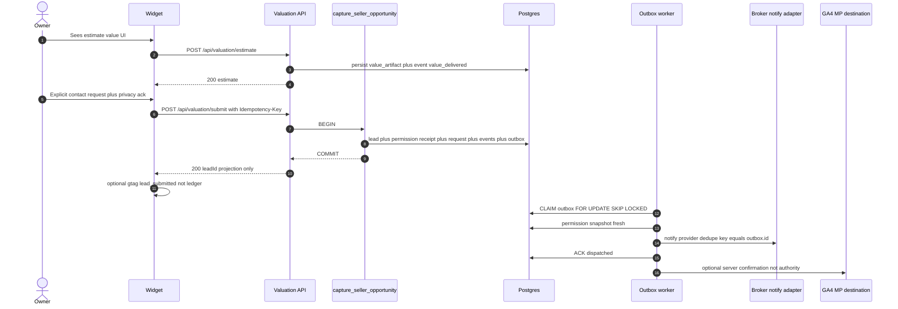
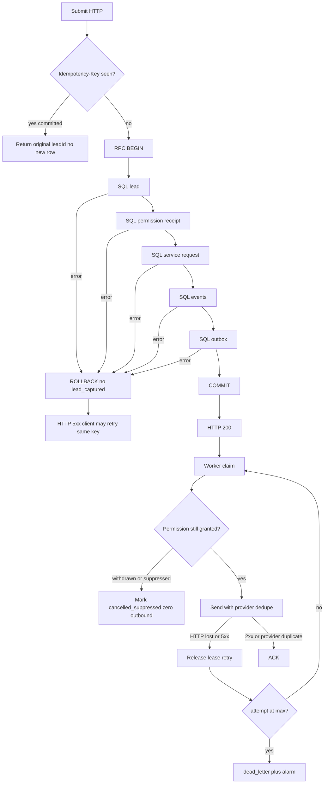

# Seller Trust Factory — event reliability contract

This document is the **source of truth for seller-journey event reliability**
(state machine, atomic capture, outbox, permission gate, SLI/SLO, failure
injection). It is not a product strategy, CAC target, or traffic plan.

Unapproved drafts in frontmatter may be read. They are **not** SoT.
Claims below are verified against this worktree at
`5d6500106a67a864b049dc372ee0a2d6be793c6f`.

Business KPI limits (CAC, conversion %, paid-consultation volume, kill
thresholds) remain **UNKNOWN — HUMAN DECISION**. They are not specified by
the founder in this worktree. This contract specifies **reliability** only.

---

## 0. Non-negotiables

1. **Client event is never authority for business conversion.** Browser
   `gtag` / `lead_submitted` / `contact_submitted` must not create a lead,
   mark a conversion, route a broker, or train ads as a closed outcome.
2. **GA4 is a destination, not a ledger.** Server may forward a minimized,
   permissioned confirmation **after** ledger commit. GA4 must not be
   queried as SoT for capture, consent, routing, or ads reconciliation.
3. **Broker notification is deterministic and independent of AI triage.**
   Missing/failing AI must still notify. AI must not gate outbound.
4. **Permission/suppression snapshot is checked immediately before every
   dispatch.** Cached `marketing_opt_in` is not sufficient.
5. **No business-critical `void` side effects** on capture (notify, send,
   charge, route). Unused-binding `void parsed.data.agency_id` is not I/O
   and is allowed.
6. **Unverified request MUST NOT be called warm or BAWSO.**
7. **Rollback preserves audit data.** Never `DROP TABLE` or delete evidence.
8. Fill no dashboard with guessed business numbers. Unknowns stay
   **UNKNOWN — HUMAN DECISION**.

---

## 1. Verified current truth (this worktree)

### 1.1 Capture is not atomic

`POST /api/valuation/submit`
(`apps/crm/src/app/api/valuation/submit/route.ts`):

1. Insert `leads` (~L141-145).
2. Insert `lead_consents` (~L152-159) via
   `buildLeadConsentInsert` (`apps/crm/src/lib/valuation/consent-mapper.ts`).
3. On consent error: compensating `leads.delete()` (~L160-163).
4. HTTP 200 only if both inserts succeed.

`lead_consents.lead_id` references `leads(id) ON DELETE CASCADE`
(`apps/crm/supabase/migrations/20260722120000_sandbox_gdpr_consent.sql`).
Compensating delete **destroys evidence**. Crash between lead insert and
consent insert leaves an orphan lead. Crash after consent and before HTTP
+ client retry can duplicate (no idempotency key). Honeypot `hp` returns
`{ ok: true }` (~L70-72) with **no lead**. Sandbox returns `ok: true` plus
a random `leadId` that is not a row (~L130).

### 1.2 Consent model is a boolean, not a receipt

Consent mapper stores `privacy_policy_version`, `acknowledged_at`,
`marketing_opt_in` only. No purpose, channel, legal basis, wording hash,
recipient, expiry, withdrawal, or suppression snapshot.

Lead mapper (`apps/crm/src/lib/valuation/lead-mapper.ts`) sets
`score: payload.sellWithin12Months ? 70 : 60` -- placeholder, not a
handoff gate in this contract.

### 1.3 Notification is coupled to AI triage (fire-and-forget)

Submit after success:

    void runInboundLeadTriageAndNotify(...)

(`apps/crm/src/app/api/valuation/submit/route.ts` ~L166).

`runInboundLeadTriageAndNotify`
(`apps/crm/src/lib/acquire/inbound-lead-triage.ts`): best-effort, never
throws; returns if `ai_triage_at` set; **calls AI first**; **returns
without notifying** if triage batch is empty (`if (!row) return`);
writes `new_lead` via `createNotification`
(`apps/crm/src/lib/notifications/store.ts`) only after triage update;
swallows errors.

Inbound email (`apps/crm/src/app/api/acquire/email/route.ts`) awaits the
same function -- still AI-gated, still not an outbox.

`apps/crm/src/lib/notify-new-lead.ts` is a separate Resend fire-and-forget
for buyer onboarding. Same anti-pattern class.

### 1.4 GA4 is client `gtag`, not a ledger

`apps/crm/src/lib/analytics/gtag.ts` no-ops without `window.gtag`.
Helpers: `apps/crm/src/lib/analytics/events.ts`,
`apps/crm/src/lib/valuation/analytics.ts`.
Fired from `apps/crm/src/components/valuation/ValuationWidgetForm.tsx`:

| Client event | When | Authority? |
|---|---|---|
| `valuation_started` | mount (~L109) | no |
| `step_completed` | UI step | no |
| `valuation_shown` | after estimate HTTP success (~L184) | no -- not `value_delivered` |
| `contact_submitted` | **before** `fetch("/api/valuation/submit")` (~L213) | **no** -- fires even if submit fails |
| `lead_submitted` | after `data.ok` (~L248) | **no** |

Honeypot/sandbox `ok: true` can still fire `lead_submitted`. Client
conversion is not `lead_captured`.

### 1.5 Value persist is best-effort and not an event

`POST /api/valuation/estimate`
(`apps/crm/src/app/api/valuation/estimate/route.ts` ~L88-113) persists
`valuation_estimates` in try/catch and **still returns `ok: true`** if
persist fails (`persistValuationEstimate`: callers must not fail the
widget). That HTTP success is not `value_delivered`.

### 1.6 Acquisition connect: client tenant claim is ignored (keep)

`POST /api/acquisition/google/connect`
(`apps/crm/src/app/api/acquisition/google/connect/route.ts`):
`agency_id` / `customer_id` from the body are ignored; tenant is
`profiles.agency_id`. `void parsed.data.agency_id` (~L76-78) is unused
field discard, not a side-effecting promise. Not a seller conversion
event. Must not emit `lead_captured`.

### 1.7 Existing outbox must not be reused

`apps/realvia-ingestion/src/ingestion/outbox.ts` selects unpublished rows
**without claim/lease / FOR UPDATE SKIP LOCKED**. Concurrent workers can
double-publish. NATS is a stub. **Do not copy as the seller-trust outbox.**

---

## 2. Precise terms: request vs warm vs BAWSO

### 2.1 Unverified request (not warm, not BAWSO)

Subject submitted an explicit request for human follow-up. Identifiers
exist but are **not** verified. Ledger name: `service_contact_requested`.

**This MUST NOT be called warm, hot, BAWSO, or call-queue ready.**

### 2.2 Contact-verified permissioned request (still not BAWSO)

`contact_verified` + permission receipt for the requested channel. Still
not warm until value, expectation, and routing gates hold.

### 2.3 Warm seller opportunity (still not BAWSO)

All server facts true:

1. `value_delivered` (durable `value_artifact` id)
2. `service_contact_requested` (explicit, not a pageview)
3. `contact_verified`
4. `lead_captured` (atomic with permission receipt)
5. Expectation contract: **who** (named broker or office), **why**,
   **channel**, **time window**
6. Permission snapshot allows that channel + recipient
7. `routed` to a tenant-scoped broker/territory that can serve the property

Until `broker_accepted`, this is a **routed warm candidate**, not BAWSO.

### 2.4 BAWSO — Broker-Accepted Warm Seller Opportunity

Warm seller opportunity **plus** `broker_accepted`. `broker_rejected` is
not BAWSO.

| Observed fact | Allowed label | Forbidden label |
|---|---|---|
| Client `lead_submitted` / `contact_submitted` | client funnel event | lead, conversion, BAWSO |
| `service_contact_requested` without `contact_verified` | unverified request | warm, BAWSO, call-queue ready |
| `lead_captured` without expectation + permission | captured request | warm / BAWSO |
| `routed` without `broker_accepted` | routed candidate | BAWSO |
| AI priority / score 60-70 | diagnostic, non-gating | handoff trigger |
| Sandbox / honeypot `ok: true` | discarded traffic | `lead_captured` |

Today's widget has **no** channel/window/named broker and **no**
`contact_verified`. Production paid traffic that treats widget submit as
warm/BAWSO **violates** this section.

---

## 3. Canonical state machine

Server-authoritative lifecycle for one tenant-scoped seller opportunity.
CRM status is a **projection** of the latest successful transition.

    value_delivered
    service_contact_requested
    contact_verified
    lead_captured
    routed
    broker_accepted | broker_rejected
    appointment_proposed
    appointment_confirmed
    appointment_held | no_show | cancelled
    mandate_signed | lost

### 3.1 Allowed transitions

    value_delivered -> service_contact_requested | lost
    service_contact_requested -> contact_verified | lost
    contact_verified -> lead_captured | lost
    lead_captured -> routed | lost
    routed -> broker_accepted | broker_rejected | lost
    broker_rejected -> routed (re-route, new routing_decision_id) | lost
    broker_accepted -> appointment_proposed | lost
    appointment_proposed -> appointment_confirmed | cancelled | lost
    appointment_confirmed -> appointment_held | no_show | cancelled | lost
    appointment_held -> mandate_signed | lost
    no_show -> appointment_proposed | lost
    cancelled -> appointment_proposed | lost
    mandate_signed -> terminal success
    lost -> terminal (reason required)

Skip-ahead is forbidden. `lead_captured` without prior `value_delivered`
+ `service_contact_requested` + `contact_verified` on the same
`opportunity_id` is a contract violation.

Side events (do not move the lifecycle pointer alone):
`consent_updated`, `permission_withdrawn`, `suppressed`, `complaint`,
`identity_merge_requested`, `outbox_dead_lettered`.

`permission_withdrawn` blocks dispatch. Whether it auto-closes the
opportunity or only suppresses outbound:
**UNKNOWN — HUMAN DECISION**.

### 3.2 Variant A vs B (ordering, not a second machine)

Variant B may persist `value_delivered` at estimate time (before contact).
Variant A may persist `value_delivered` on the submit path when that is
the first durable delivery. Same machine; no skip of `contact_verified`.

### 3.3 Happy path



### 3.4 Failure path



---

## 4. Per-event contract

Envelope (every ledger event):

    event_id, event_name, schema_version,
    occurred_at, received_at,
    tenant_id, opportunity_id, subject_id,
    value_artifact_id, consent_receipt_id,
    idempotency_key,   -- unique (tenant_id, event_name, idempotency_key)
    trace_id,
    payload            -- NO raw PII (section 11)

PII classes: `none` | `indirect` (ids, hashed refs) | `direct_restricted`
(person/lead tables only, never in `payload`).

Retention days: **UNKNOWN — HUMAN DECISION** (DPO). Ledger rows are not
deleted on feature rollback (section 12).

### 4.1 `value_delivered`

| Field | Contract |
|---|---|
| Producer | Server estimate API (variant B) or submit path when that is first durable delivery (variant A). Producer is the API that persisted `value_artifact`. |
| Authority | Ledger row + `value_artifact` (inputs, source, version, uncertainty, expiry). Client `valuation_shown` is not authority. |
| Idempotency key | `{tenant_id}:value_delivered:{session_id}:{artifact_hash}` |
| Allowed from | start |
| PII class | `none` in payload. Location granularity **UNKNOWN — HUMAN DECISION**; default region code, not street. |
| Retention | **UNKNOWN — HUMAN DECISION** |
| Downstream | UI; later capture RPC must pass `value_artifact_id` |
| Failure policy | If artifact persist fails, do **not** emit `value_delivered`. In-response estimate display is not a conversion. |

### 4.2 `service_contact_requested`

| Field | Contract |
|---|---|
| Producer | Capture/request RPC with explicit channel, window, recipient class. Today's widget lacks these fields -- they are **required before this event is legal in paid traffic**. |
| Authority | RPC insert of `service_contact_request` |
| Idempotency key | `{tenant_id}:service_contact_requested:{Idempotency-Key}` |
| Allowed from | `value_delivered` |
| PII class | `indirect` |
| Retention | **UNKNOWN — HUMAN DECISION** |
| Downstream | verification worker; **not** broker call queue |
| Failure policy | Rolled back with RPC. Unverified request must not be labeled warm/BAWSO. |

### 4.3 `contact_verified`

| Field | Contract |
|---|---|
| Producer | Verification service. Method **UNKNOWN — HUMAN DECISION** (SMS OTP / email OTP / verified callback). |
| Authority | Server verification record (`verified_at`, `method`, `subject_id`) |
| Idempotency key | `{tenant_id}:contact_verified:{subject_id}:{method}` |
| Allowed from | `service_contact_requested` |
| PII class | `indirect` (no OTP codes in payload) |
| Retention | **UNKNOWN — HUMAN DECISION** |
| Downstream | same-tx capture or `promote_verified_opportunity()` |
| Failure policy | Failed verification is not `lead_captured`. No broker notify. |

### 4.4 `lead_captured`

| Field | Contract |
|---|---|
| Producer | **Only** `capture_seller_opportunity()` COMMIT (or `promote_verified_opportunity()` if split). Never widget, GA4, or triage. |
| Authority | Ledger + opportunity row in the same transaction |
| Idempotency key | client `Idempotency-Key` header, unique per `(tenant_id, key)` |
| Allowed from | `contact_verified` |
| PII class | `indirect` |
| Retention | **UNKNOWN — HUMAN DECISION** |
| Downstream | outbox: required `broker_notify`; optional non-gating `ai_triage`; optional permissioned `ads_confirmation` |
| Failure policy | Any SQL error -> ROLLBACK -> **no** `lead_captured`. Lost HTTP after COMMIT: retry returns same ids. |

Honeypot and sandbox must not emit this event.

### 4.5 `routed`

| Field | Contract |
|---|---|
| Producer | Deterministic routing engine (territory, capacity, tenant). Not AI. |
| Authority | `routing_decision` row |
| Idempotency key | `{tenant_id}:routed:{opportunity_id}:{routing_decision_id}` |
| Allowed from | `lead_captured` or `broker_rejected` (re-route) |
| PII class | `indirect` |
| Retention | **UNKNOWN — HUMAN DECISION** |
| Downstream | outbox recipient may be patched only while status=`pending` |
| Failure policy | No territory -> `lost` reason `out_of_area`. No silent drop. |

### 4.6 `broker_accepted` / `broker_rejected`

| Field | Contract |
|---|---|
| Producer | Authenticated broker action in CRM (human). |
| Authority | CRM write + ledger; `profile.agency_id` must match opportunity tenant |
| Idempotency key | `{tenant_id}:broker_{accepted\|rejected}:{opportunity_id}:{actor_id}:{decision_seq}` |
| Allowed from | `routed` |
| PII class | `indirect` (reason code enum) |
| Retention | **UNKNOWN — HUMAN DECISION** |
| Downstream | SLA clock on accept; reject -> re-route or `lost` |
| Failure policy | Cross-tenant actor -> fail closed. |

**Only `broker_accepted` may be called BAWSO**, and only if section 2 warm gates hold.

### 4.7 `appointment_proposed`

| Field | Contract |
|---|---|
| Producer | Broker or owner-confirmed slot writer |
| Authority | calendar row in CRM |
| Idempotency key | `{tenant_id}:appointment_proposed:{opportunity_id}:{slot_hash}` |
| Allowed from | `broker_accepted` |
| PII class | `indirect` |
| Retention | **UNKNOWN — HUMAN DECISION** |
| Downstream | owner confirmation outbox (permission-checked) |
| Failure policy | Send only after fresh permission snapshot. |

### 4.8 `appointment_confirmed`

| Field | Contract |
|---|---|
| Producer | Owner confirmation or broker recording of owner confirmation (method logged) |
| Authority | CRM appointment status |
| Idempotency key | `{tenant_id}:appointment_confirmed:{appointment_id}` |
| Allowed from | `appointment_proposed` |
| PII class | `indirect` |
| Retention | **UNKNOWN — HUMAN DECISION** |
| Downstream | reminder outbox |
| Failure policy | Dual confirm with same key is a no-op. |

### 4.9 `appointment_held` / `no_show` / `cancelled`

| Field | Contract |
|---|---|
| Producer | Broker outcome form (human). Calendar sync alone may not emit `appointment_held` unless **UNKNOWN — HUMAN DECISION** later authorizes it. |
| Authority | CRM outcome row |
| Idempotency key | `{tenant_id}:{event_name}:{appointment_id}` |
| Allowed from | `appointment_confirmed` (`cancelled` also from `appointment_proposed`) |
| PII class | `indirect` |
| Retention | **UNKNOWN — HUMAN DECISION** |
| Downstream | ads offline outcome only if permission + minimization allow; destination, not ledger |
| Failure policy | Calendar webhook without human confirm is not `appointment_held`. |

### 4.10 `mandate_signed` / `lost`

| Field | Contract |
|---|---|
| Producer | Broker/ops recording of mandate or loss reason |
| Authority | CRM + ledger |
| Idempotency key | `{tenant_id}:{mandate_signed\|lost}:{opportunity_id}` |
| Allowed from | section 3.1 |
| PII class | `indirect` (`lost_reason` enum) |
| Retention | **UNKNOWN — HUMAN DECISION** |
| Downstream | closed-loop ads only as destination after permission check |
| Failure policy | Client thank-you page is not `mandate_signed`. |

---

## 5. Authority model

| Concern | Authority | Not authority |
|---|---|---|
| Business conversion / opportunity state | Server CRM + append-only event ledger | Browser, `gtag`, client MP hit, ads pixel |
| Permission to contact / suppress | Consent + suppression ledger, re-read immediately before every dispatch | Cached flag, AI triage, CRM note, marketing opt-in boolean alone |
| History / analytics | Append-only `business_event` rows | GA4, Meta, Google Ads, client `dataLayer` |
| Dispatch intent | Transactional outbox row committed with the business write | `void someAsyncSideEffect(...)` |
| Tenant identity | Server auth / `profiles.agency_id` / RPC `p_tenant_id` | Client JSON `agency_id` |

GA4 mapping (destination only, after commit):

| Ledger event | Client analog (not SoT) | Allowed destination |
|---|---|---|
| `value_delivered` | `valuation_shown` | server MP after persist |
| `service_contact_requested` | `contact_submitted` | do not use today's pre-fetch gtag |
| `lead_captured` | `lead_submitted` | server MP after RPC commit only |
| `appointment_held` | offline qualified consultation | **UNKNOWN — HUMAN DECISION** |
| `mandate_signed` | offline mandate | **UNKNOWN — HUMAN DECISION** |

---

## 6. Exact atomic RPC boundary

**Name:** `capture_seller_opportunity`.

**When:** after `value_delivered` + `service_contact_requested` +
`contact_verified` facts are available (verified contact may be created
inside this same transaction if verification is synchronous).

**Single Postgres transaction. No application-level compensating DELETE.**

### 6.1 Arguments (minimum)

    p_tenant_id            uuid
    p_idempotency_key      text
    p_value_artifact_id    uuid
    p_subject              -- ids + restricted columns, not event payload
    p_request              -- channel, window, recipient, purpose
    p_consent              -- purpose, channel, legal_basis, notice_version,
                           -- wording_hash, evidence_hash, granted_at
    p_trace_id             text

Client `agency_id` is ignored. Tenant is `p_tenant_id` resolved server-side
the same way connect ignores body `agency_id`
(`apps/crm/src/app/api/acquisition/google/connect/route.ts`).

### 6.2 SQL steps (order is the test surface)

| Step | Write | On error |
|---|---|---|
| 0 | SELECT existing capture by `(tenant_id, idempotency_key)` -- if committed, return existing ids | fail closed |
| 1 | Insert/upsert lead / seller_opportunity (`tenant_id` CHECK) | ROLLBACK |
| 2 | Insert permission receipt (`consent_receipt`) FK -> opportunity + tenant | ROLLBACK |
| 3 | Insert service_contact_request FK -> opportunity + tenant | ROLLBACK |
| 4 | Insert business_event rows including **`lead_captured`** | ROLLBACK |
| 5 | Insert outbox rows: required `broker_notify`; optional `ai_triage`; optional `ads_confirmation` | ROLLBACK |
| 6 | COMMIT | -- |

There is **no step 7** outside the transaction required for `lead_captured`
to exist.

FK rule: every child `tenant_id` equals parent `tenant_id`. Mismatch ->
raise -> ROLLBACK.

### 6.3 Forbidden inside this RPC

- `DELETE FROM leads` / consent tables as compensation
- calling HTTP (AI, Resend, GA4, Ads)
- `void` / fire-and-forget
- writing `lead_captured` before steps 1-3 succeed
- using client GA4 as a write trigger

### 6.4 Split vs combined verification

If verification is asynchronous:

1. `request_seller_contact()` -- request + `service_contact_requested` only
   (no `lead_captured`, no `broker_notify`).
2. `promote_verified_opportunity()` -- `contact_verified` + `lead_captured`
   + outbox.

Unverified request still must not notify the broker call queue.

---

## 7. Outbox contract

Working name: `seller_event_outbox` (name may change; semantics may not).

    id, tenant_id, opportunity_id, event_id,
    kind: broker_notify | ai_triage | ads_confirmation | owner_message,
    status: pending | claimed | dispatched | cancelled_suppressed | dead_letter,
    attempt, max_attempts,
    claimed_by, claimed_at, lease_until,
    payload_ref,
    provider, provider_dedupe_key, provider_message_id,
    last_error, next_attempt_at,
    created_at, dispatched_at

### 7.1 Claim / lease

```sql
UPDATE seller_event_outbox o
SET status = 'claimed',
    claimed_by = $worker_id,
    claimed_at = now(),
    lease_until = now() + interval '30 seconds',
    attempt = o.attempt + 1
WHERE o.id = (
  SELECT id FROM seller_event_outbox
  WHERE status IN ('pending', 'claimed')
    AND (status = 'pending' OR lease_until < now())
    AND attempt < max_attempts
    AND next_attempt_at <= now()
  ORDER BY created_at
  FOR UPDATE SKIP LOCKED
  LIMIT 1
)
RETURNING *;
```

**Concurrency:** two workers cannot claim the same row (`SKIP LOCKED` +
row lock). Test: two concurrent workers -> one dispatch.

Lease default **30s**. Do not `SELECT ... WHERE published_at IS NULL`
without locking (realvia-ingestion anti-pattern).

### 7.2 Retry / backoff / max attempts

| Parameter | Engineering default (this contract) |
|---|---|
| max_attempts | 8 |
| backoff | exponential 1s * 2^n, cap 5 minutes |
| next_attempt_at | set on failed send before releasing lease |
| jitter | 20 percent |

Business volume/SLA kill switches: **UNKNOWN — HUMAN DECISION**.

### 7.3 Dead letter, replay, provider dedupe

- After `attempt >= max_attempts`: `status = dead_letter`, ledger
  `outbox_dead_lettered`, alarm. **Do not delete.**
- Replay: ops sets `status=pending`, `attempt=0`, `next_attempt_at=now()`,
  **same** `provider_dedupe_key`.
- `provider_dedupe_key = outbox.id::text`. Adapters send this to the
  provider (Resend header, notification unique key, Ads `order_id`).
- Provider 409 / duplicate-success -> ACK as dispatched.

### 7.4 Crash recovery

| Crash point | Recovery |
|---|---|
| After COMMIT, before claim | row `pending` -> later worker claims |
| After claim, before send | lease expires -> another worker claims |
| After send, before ACK | retry with same provider dedupe -> one user-visible notify |
| After ACK | terminal `dispatched` |

Exactly-once **effect** = at-least-once delivery + provider idempotency.
Exactly-once **ledger** = unique `(tenant_id, event_name, idempotency_key)`.

### 7.5 Reconciliation and alarms

Every 5 minutes (cron, measurable SQL):

    mismatch_count =
      count(lead_captured without broker_notify outbox)
    + count(outbox dispatched without provider_message_id)
    + count(claimed AND lease_until < now() - interval '5 minutes')

| Alarm | Condition (server SoT = these queries) |
|---|---|
| Capture without notify intent | `lead_captured` minus `broker_notify` outbox > 0 |
| DLQ | `dead_letter` inserted in 15m > 0 |
| Lease stuck | claimed past lease+5m > 0 |
| Lag | p95 `dispatched_at - outbox.created_at` > 60s over 15m |
| Permission bypass | dispatched where suppression forbids channel > 0 (must be 0) |

---

## 8. Permission / suppression snapshot

**Immediately before every dispatch** (email, SMS, phone queue card,
push, ads confirmation):

1. Read current `consent_receipt` + `suppression` for
   `(tenant_id, subject_id, channel, purpose, recipient_id)`.
2. If withdrawn, expired, denied, or globally suppressed -> set outbox
   `cancelled_suppressed`, **zero outbound**, side-event
   `permission_withdrawn` if missing.
3. AI triage, CRM hot flags, and cached `marketing_opt_in` cannot override.

Today's `marketing_opt_in` boolean is insufficient.

Worker must re-read **after claim and before HTTP**. Test: withdrawal
before dispatch -> zero outbound.

---

## 9. Broker notification independent of AI

Split today's `runInboundLeadTriageAndNotify`:

| Stream | Outbox kind | Gates notify? | May fail |
|---|---|---|---|
| Broker/owner new_lead | `broker_notify` | **No AI.** Deterministic title/body from request + property facts + tenant. | Isolated; retry |
| AI priority / reason | `ai_triage` | **Must not** gate `broker_notify`. Empty/timeout/error -> skip enrichment only. | Isolated |

`createNotification` may remain the adapter **behind** the outbox worker.
It must not be invoked with `void` from the submit request.

Existence of the notification is constant priority (e.g. `high`). AI may
later update a non-authoritative enrichment field. Missing AI must still
notify.

---

## 10. SLI / SLO (measurable, server SoT)

Business KPI numeric targets remain **UNKNOWN — HUMAN DECISION**.

Reliability SLOs below are this contract's engineering defaults. Numerator
and denominator are **SQL against Postgres** (event ledger + outbox), not
GA4.

| ID | SLI (numerator / denominator) | SLO | Source of truth |
|---|---|---|---|
| R1 | count(RPC commit with lead+receipt+request+event+outbox) / count(RPC attempts that passed validation) | 100% atomic (failed attempts have 0 committed fragments) | RPC + tables; staging probes |
| R2 | count(dispatches with fresh permission grant) / count(dispatches) | 100% | outbox column `permission_snapshot_id` |
| R3 | count(outbound after effective withdrawal) / count(withdrawals) | 0 | suppression vs provider send log |
| R4 | count(cross-tenant visible rows) / count(all rows in seller tables) | 0 | RLS + RPC tenant check |
| R5 | count(duplicate opportunities with same idempotency_key) / count(capture commits) | 0 | unique index |
| R6 | count(broker_notify dispatched or in-retry or DLQ) / count(lead_captured) | 100% have notify intent | join event to outbox |
| R7 | percentile(dispatched_at - lead_captured.occurred_at) | p95 < 60s | timestamps on ledger/outbox |
| R8 | count(value_delivered) / count(successful artifact persists) | 100% | artifact + event |
| R9 | abs(count(lead_captured) - count(CRM opportunities in captured+)) / count(lead_captured) | < 0.5% | reconciliation job |
| R10 | count(event.payload keys intersect PII_BLOCKLIST) | 0 | payload linter + test |

RPO/RTO for restore drills: **UNKNOWN — HUMAN DECISION** (cost vs risk).

---

## 11. Payload PII rules

**Forbidden in `business_event.payload` and outbox adapter logs:**
raw email, phone, name, street address, exact GPS, free-text notes that
echo those fields, OTP codes, access tokens.

**Allowed:** `tenant_id`, `opportunity_id`, `subject_id`, keyed HMAC
identifiers (not raw SHA of email), property type, region code, artifact
id, channel enum, boolean flags.

Direct PII stays in RLS-protected person/lead columns.

---

## 12. Rollback and audit preservation

- Allowed: stop workers; feature-flag RPC off; return submit to old path
  only if old path remains in git history.
- **Forbidden:** `DROP TABLE` of `business_event`, `consent_receipt`,
  `seller_event_outbox`, `service_contact_request`, or opportunity tables
  that contain production rows.
- **Forbidden:** `DELETE` of ledger/outbox/consent rows to "clean" a failed
  release.
- Allowed: rename tables in place; add `retired_at`.
- Today's compensating `DELETE FROM leads` (~L162 submit route) is
  **incompatible** because of `ON DELETE CASCADE` on `lead_consents`.

Failed RPC: `ROLLBACK` (no row). The attempt never existed. Optional
append-only `rpc_attempt_log` outside the capture transaction:
**UNKNOWN — HUMAN DECISION**.

---

## 13. Failure-injection matrix (mandatory tests)

Design-required tests for the **implementation** PR. This docs PR does
not add them.

| ID | Injection | Expected |
|---|---|---|
| T1 | Error after SQL step 1 (lead) | 0 rows in receipt/request/event/outbox; HTTP 5xx; no `lead_captured` |
| T2 | Error after SQL step 2 (permission receipt) | all-or-nothing rollback |
| T3 | Error after SQL step 3 (request) | all-or-nothing rollback |
| T4 | Error after SQL step 4 (events) | all-or-nothing rollback |
| T5 | Error after SQL step 5 (outbox) | all-or-nothing rollback; no `lead_captured` |
| T6 | HTTP response lost after COMMIT; client retries same Idempotency-Key | one lead, one outbox `broker_notify`, same ids |
| T7 | Two concurrent outbox workers | one dispatch (one provider dedupe key) |
| T8 | Kill worker after claim, before send | lease expiry; second worker sends once |
| T9 | Kill worker after send, before ACK | retry + provider dedupe -> one user-visible notify |
| T10 | Withdrawal committed after outbox insert, before send | `cancelled_suppressed`; **zero outbound** |
| T11 | Child `tenant_id` != parent / FK to other agency | RPC fail; no commit |
| T12 | Validation fail, honeypot, sandbox, or 5xx before COMMIT | **no** `lead_captured`; client `lead_submitted` if any is ignored |
| T13 | Event payload contains email/phone/name | reject at write; test fails |
| T14 | `void runInboundLeadTriageAndNotify` (or any business-critical void promise) on capture path | forbidden; static/verification test |
| T15 | AI triage timeout / empty batch | `broker_notify` still dispatched |
| T16 | Cross-tenant broker accept | transition fail |

`void parsed.data.agency_id` on the connect route is not T14 (no I/O).

---

## 14. void side-effect rule

Business-critical effects (capture, consent, notify, send, charge, route)
must be awaited inside a durable boundary (RPC or outbox worker).

| Location today | Verdict |
|---|---|
| `void runInboundLeadTriageAndNotify` in submit route | **Forbidden** under this contract |
| `void parsed.data.*` in Google connect | Allowed unused-binding discard |
| `persistValuationEstimate` best-effort log-and-continue | Forbidden for emitting `value_delivered`; allowed only if no ledger event is written |

---

## 15. Implementation gap vs today (honest)

| Contract requirement | Today |
|---|---|
| Atomic RPC | Two inserts + delete compensation |
| Idempotency-Key | Absent on valuation submit |
| Event ledger | Client GA4 only |
| Outbox claim/lease | None for seller capture; ingestion outbox is unsafe to copy |
| Permission snapshot before send | Boolean `marketing_opt_in` at insert time |
| Notify independent of AI | Coupled; empty triage skips notify |
| `contact_verified` | Absent |
| Expectation (who/why/channel/when) | Absent on widget types |
| Broker accept/reject / appointments / mandate | Not in this widget flow |
| BAWSO measurement | Cannot be computed; do not fake it |

---

## 16. Acceptance checklist (this document)

- [x] Canonical state machine including required names
- [x] Per-event producer, authority, idempotency, transition, PII, retention, consumer, failure policy
- [x] Client event is never conversion authority; GA4 is destination
- [x] Exact RPC step boundary for lead + permission receipt + request + event + outbox
- [x] Outbox claim/lease, concurrency, retry, max attempts, DLQ, replay, provider dedupe, reconciliation, alarms
- [x] Permission snapshot immediately before dispatch
- [x] Broker notify independent of AI triage
- [x] SLO with numerator, denominator, server SoT
- [x] Failure-injection matrix including all mandated cases
- [x] Happy-path and failure-path diagrams
- [x] BAWSO / warm / unverified request definitions
- [x] Rollback preserves audit; no DROP TABLE / evidence delete
- [x] Unknowns marked UNKNOWN — HUMAN DECISION

---

## 17. Open unknowns — HUMAN DECISION

| ID | Unknown |
|---|---|
| U1 | Contact verification method (SMS OTP, email OTP, human callback) |
| U2 | Retention days per PII class and per event |
| U3 | Whether withdrawal auto-lost the opportunity or only suppresses outbound |
| U4 | Whether calendar sync alone may emit `appointment_held` |
| U5 | RPO/RTO numeric targets |
| U6 | All business KPI limits (CAC, consult volume, kill thresholds) |
| U7 | Legal basis / wording for service-contact vs marketing (DPO) |
| U8 | Location granularity allowed in `value_delivered` payload |
| U9 | Whether `rpc_attempt_log` is required outside the capture transaction |

No unknown above may be filled with a guessed number in dashboards.